# Cortana AI Assistant - System Diagrams

**Comprehensive Diagrams for Graduation Report**

This document contains Data Flow Diagrams (DFD), Sequence Diagrams, and Class Diagrams for the Cortana AI Assistant system.

**How to Render:**
- Use https://mermaid.live/ to render these diagrams
- Or use VS Code with "Markdown Preview Mermaid Support" extension
- Export as PNG/SVG for inclusion in your report

---

# Table of Contents

1. [Data Flow Diagrams (DFD)](#data-flow-diagrams)
   - Context Diagram (Level 0)
   - Level 1 DFD - Main System
   - Level 2 DFD - Finance Module
   - Level 2 DFD - AI Chat Module
   - Level 2 DFD - Health Module

2. [Sequence Diagrams](#sequence-diagrams)
   - User Authentication
   - Add Transaction (Manual)
   - Add Transaction (Voice)
   - Receipt OCR Processing
   - AI Chat Conversation
   - Budget Alert System
   - Telegram Integration
   - News Aggregation
   - Workout Logging

3. [Class Diagrams](#class-diagrams)
   - Database Schema
   - Backend Services
   - API Endpoints
   - Frontend Architecture

---

# Data Flow Diagrams

## 1. Context Diagram (Level 0 DFD)

This diagram shows the Cortana system as a single process and its interactions with external entities.

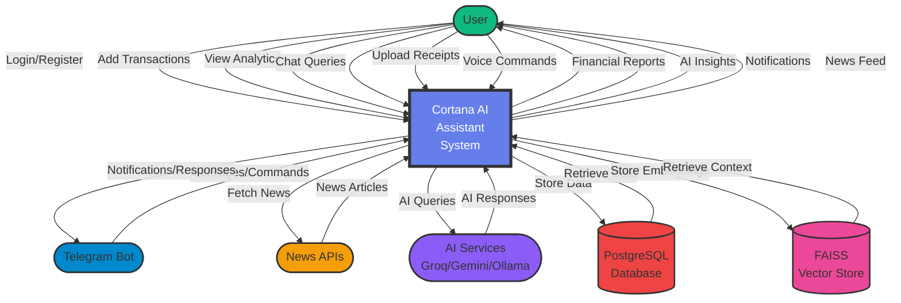
```mermaid
graph TB
    User([User])
    Telegram([Telegram Bot])
    NewsAPI([News APIs])
    AIService([AI Services<br/>Groq/Gemini/Ollama])
    Database[(PostgreSQL<br/>Database)]
    VectorDB[(FAISS<br/>Vector Store)]

    User -->|Login/Register| CortanaSystem
    User -->|Add Transactions| CortanaSystem
    User -->|View Analytics| CortanaSystem
    User -->|Chat Queries| CortanaSystem
    User -->|Upload Receipts| CortanaSystem
    User -->|Voice Commands| CortanaSystem

    CortanaSystem -->|Financial Reports| User
    CortanaSystem -->|AI Insights| User
    CortanaSystem -->|Notifications| User
    CortanaSystem -->|News Feed| User

    Telegram -->|Messages/Commands| CortanaSystem
    CortanaSystem -->|Notifications/Responses| Telegram

    CortanaSystem -->|Fetch News| NewsAPI
    NewsAPI -->|News Articles| CortanaSystem

    CortanaSystem -->|AI Queries| AIService
    AIService -->|AI Responses| CortanaSystem

    CortanaSystem -->|Store Data| Database
    Database -->|Retrieve Data| CortanaSystem

    CortanaSystem -->|Store Embeddings| VectorDB
    VectorDB -->|Retrieve Context| CortanaSystem

    style CortanaSystem fill:#667EEA,stroke:#333,stroke-width:4px,color:#fff
    style User fill:#10B981,stroke:#333,stroke-width:2px
    style Telegram fill:#0088cc,stroke:#333,stroke-width:2px
    style NewsAPI fill:#F59E0B,stroke:#333,stroke-width:2px
    style AIService fill:#8B5CF6,stroke:#333,stroke-width:2px
    style Database fill:#EF4444,stroke:#333,stroke-width:2px
    style VectorDB fill:#EC4899,stroke:#333,stroke-width:2px

    CortanaSystem[Cortana AI<br/>Assistant<br/>System]
```

---

## 2. Level 1 DFD - Main System

This diagram breaks down the Cortana system into its major subsystems.

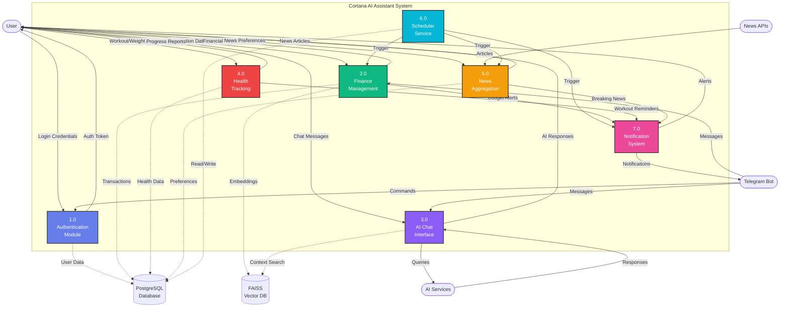
```mermaid
graph TB
    User([User])
    TelegramBot([Telegram Bot])
    NewsAPIs([News APIs])
    AI([AI Services])

    subgraph "Cortana AI Assistant System"
        Auth[1.0<br/>Authentication<br/>Module]
        Finance[2.0<br/>Finance<br/>Management]
        Chat[3.0<br/>AI Chat<br/>Interface]
        Health[4.0<br/>Health<br/>Tracking]
        News[5.0<br/>News<br/>Aggregation]
        Scheduler[6.0<br/>Scheduler<br/>Service]
        Notification[7.0<br/>Notification<br/>System]
    end

    Database[(PostgreSQL<br/>Database)]
    VectorDB[(FAISS<br/>Vector DB)]

    User -->|Login Credentials| Auth
    Auth -->|Auth Token| User

    User -->|Transaction Data| Finance
    Finance -->|Financial Reports| User

    User -->|Chat Messages| Chat
    Chat -->|AI Responses| User

    User -->|Workout/Weight Data| Health
    Health -->|Progress Reports| User

    User -->|News Preferences| News
    News -->|News Articles| User

    TelegramBot -->|Commands| Auth
    TelegramBot -->|Messages| Finance
    TelegramBot -->|Messages| Chat

    Notification -->|Alerts| User
    Notification -->|Notifications| TelegramBot

    NewsAPIs -->|Articles| News
    Chat -->|Queries| AI
    AI -->|Responses| Chat

    Auth -.->|User Data| Database
    Finance -.->|Transactions| Database
    Health -.->|Health Data| Database
    News -.->|Preferences| Database
    Scheduler -.->|Read/Write| Database

    Finance -.->|Embeddings| VectorDB
    Chat -.->|Context Search| VectorDB

    Scheduler -->|Trigger| Finance
    Scheduler -->|Trigger| News
    Scheduler -->|Trigger| Notification

    Finance -->|Budget Alerts| Notification
    Health -->|Workout Reminders| Notification
    News -->|Breaking News| Notification

    style Auth fill:#667EEA,stroke:#333,stroke-width:2px,color:#fff
    style Finance fill:#10B981,stroke:#333,stroke-width:2px,color:#fff
    style Chat fill:#8B5CF6,stroke:#333,stroke-width:2px,color:#fff
    style Health fill:#EF4444,stroke:#333,stroke-width:2px,color:#fff
    style News fill:#F59E0B,stroke:#333,stroke-width:2px,color:#fff
    style Scheduler fill:#06B6D4,stroke:#333,stroke-width:2px,color:#fff
    style Notification fill:#EC4899,stroke:#333,stroke-width:2px,color:#fff
```

---

## 3. Level 2 DFD - Finance Module

Detailed data flow within the Finance Management subsystem.

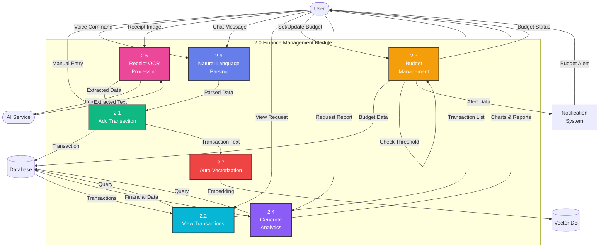
```mermaid
graph TB
    User([User])
    AI([AI Service])

    subgraph "2.0 Finance Management Module"
        AddTrans[2.1<br/>Add Transaction]
        ViewTrans[2.2<br/>View Transactions]
        BudgetMgmt[2.3<br/>Budget<br/>Management]
        Analytics[2.4<br/>Generate<br/>Analytics]
        OCR[2.5<br/>Receipt OCR<br/>Processing]
        NLP[2.6<br/>Natural Language<br/>Parsing]
        AutoVectorize[2.7<br/>Auto-Vectorization]
    end

    Database[(Database)]
    VectorDB[(Vector DB)]

    User -->|Manual Entry| AddTrans
    User -->|Voice Command| NLP
    User -->|Receipt Image| OCR
    User -->|Chat Message| NLP

    NLP -->|Parsed Data| AddTrans
    OCR -->|Extracted Data| AddTrans

    AddTrans -->|Transaction| Database
    AddTrans -->|Transaction Text| AutoVectorize
    AutoVectorize -->|Embedding| VectorDB

    User -->|View Request| ViewTrans
    ViewTrans -->|Query| Database
    Database -->|Transactions| ViewTrans
    ViewTrans -->|Transaction List| User

    User -->|Set/Update Budget| BudgetMgmt
    BudgetMgmt -->|Budget Data| Database
    BudgetMgmt -->|Budget Status| User

    User -->|Request Report| Analytics
    Analytics -->|Query| Database
    Database -->|Financial Data| Analytics
    Analytics -->|Charts & Reports| User

    BudgetMgmt -->|Check Threshold| BudgetMgmt
    BudgetMgmt -->|Alert Data| Notification[Notification<br/>System]
    Notification -->|Budget Alert| User

    OCR -->|Image| AI
    AI -->|Extracted Text| OCR

    style AddTrans fill:#10B981,stroke:#333,stroke-width:2px,color:#fff
    style ViewTrans fill:#06B6D4,stroke:#333,stroke-width:2px,color:#fff
    style BudgetMgmt fill:#F59E0B,stroke:#333,stroke-width:2px,color:#fff
    style Analytics fill:#8B5CF6,stroke:#333,stroke-width:2px,color:#fff
    style OCR fill:#EC4899,stroke:#333,stroke-width:2px,color:#fff
    style NLP fill:#667EEA,stroke:#333,stroke-width:2px,color:#fff
    style AutoVectorize fill:#EF4444,stroke:#333,stroke-width:2px,color:#fff
```

---

## 4. Level 2 DFD - AI Chat Module

Detailed data flow within the AI Chat subsystem.

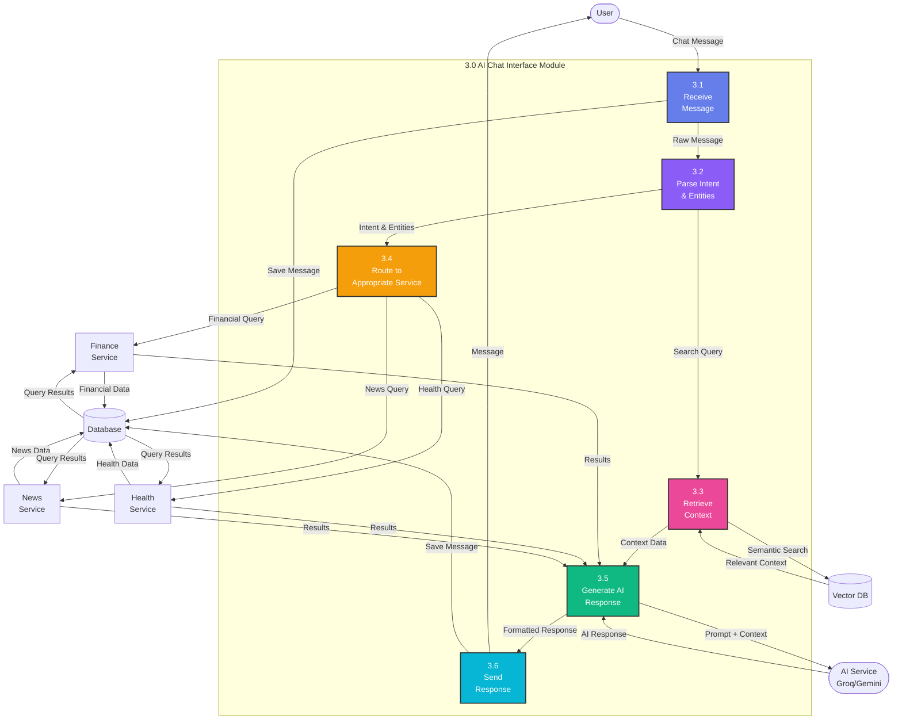
```mermaid
graph TB
    User([User])

    subgraph "3.0 AI Chat Interface Module"
        ReceiveMsg[3.1<br/>Receive<br/>Message]
        ParseIntent[3.2<br/>Parse Intent<br/>& Entities]
        RetrieveContext[3.3<br/>Retrieve<br/>Context]
        RouteQuery[3.4<br/>Route to<br/>Appropriate Service]
        GenerateResponse[3.5<br/>Generate AI<br/>Response]
        SendResponse[3.6<br/>Send<br/>Response]
    end

    FinanceService[Finance<br/>Service]
    HealthService[Health<br/>Service]
    NewsService[News<br/>Service]

    Database[(Database)]
    VectorDB[(Vector DB)]
    AIService([AI Service<br/>Groq/Gemini])

    User -->|Chat Message| ReceiveMsg
    ReceiveMsg -->|Raw Message| ParseIntent

    ParseIntent -->|Intent & Entities| RouteQuery
    ParseIntent -->|Search Query| RetrieveContext

    RetrieveContext -->|Semantic Search| VectorDB
    VectorDB -->|Relevant Context| RetrieveContext
    RetrieveContext -->|Context Data| GenerateResponse

    RouteQuery -->|Financial Query| FinanceService
    RouteQuery -->|Health Query| HealthService
    RouteQuery -->|News Query| NewsService

    FinanceService -->|Financial Data| Database
    Database -->|Query Results| FinanceService
    FinanceService -->|Results| GenerateResponse

    HealthService -->|Health Data| Database
    Database -->|Query Results| HealthService
    HealthService -->|Results| GenerateResponse

    NewsService -->|News Data| Database
    Database -->|Query Results| NewsService
    NewsService -->|Results| GenerateResponse

    GenerateResponse -->|Prompt + Context| AIService
    AIService -->|AI Response| GenerateResponse

    GenerateResponse -->|Formatted Response| SendResponse
    SendResponse -->|Message| User

    ReceiveMsg -->|Save Message| Database
    SendResponse -->|Save Message| Database

    style ReceiveMsg fill:#667EEA,stroke:#333,stroke-width:2px,color:#fff
    style ParseIntent fill:#8B5CF6,stroke:#333,stroke-width:2px,color:#fff
    style RetrieveContext fill:#EC4899,stroke:#333,stroke-width:2px,color:#fff
    style RouteQuery fill:#F59E0B,stroke:#333,stroke-width:2px,color:#fff
    style GenerateResponse fill:#10B981,stroke:#333,stroke-width:2px,color:#fff
    style SendResponse fill:#06B6D4,stroke:#333,stroke-width:2px,color:#fff
```

---

## 5. Level 2 DFD - Health Module

Detailed data flow within the Health Tracking subsystem.

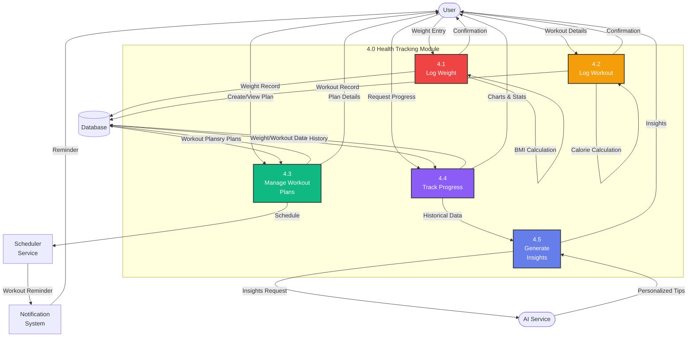
```mermaid
graph TB
    User([User])

    subgraph "4.0 Health Tracking Module"
        LogWeight[4.1<br/>Log Weight]
        LogWorkout[4.2<br/>Log Workout]
        ManagePlans[4.3<br/>Manage Workout<br/>Plans]
        TrackProgress[4.4<br/>Track Progress]
        GenerateInsights[4.5<br/>Generate<br/>Insights]
    end

    Database[(Database)]
    AIService([AI Service])

    User -->|Weight Entry| LogWeight
    LogWeight -->|Weight Record| Database
    LogWeight -->|BMI Calculation| LogWeight
    LogWeight -->|Confirmation| User

    User -->|Workout Details| LogWorkout
    LogWorkout -->|Workout Record| Database
    LogWorkout -->|Calorie Calculation| LogWorkout
    LogWorkout -->|Confirmation| User

    User -->|Create/View Plan| ManagePlans
    ManagePlans -->|Query Plans| Database
    Database -->|Workout Plans| ManagePlans
    ManagePlans -->|Plan Details| User

    User -->|Request Progress| TrackProgress
    TrackProgress -->|Query History| Database
    Database -->|Weight/Workout Data| TrackProgress
    TrackProgress -->|Charts & Stats| User

    TrackProgress -->|Historical Data| GenerateInsights
    GenerateInsights -->|Insights Request| AIService
    AIService -->|Personalized Tips| GenerateInsights
    GenerateInsights -->|Insights| User

    ManagePlans -->|Schedule| Scheduler[Scheduler<br/>Service]
    Scheduler -->|Workout Reminder| Notification[Notification<br/>System]
    Notification -->|Reminder| User

    style LogWeight fill:#EF4444,stroke:#333,stroke-width:2px,color:#fff
    style LogWorkout fill:#F59E0B,stroke:#333,stroke-width:2px,color:#fff
    style ManagePlans fill:#10B981,stroke:#333,stroke-width:2px,color:#fff
    style TrackProgress fill:#8B5CF6,stroke:#333,stroke-width:2px,color:#fff
    style GenerateInsights fill:#667EEA,stroke:#333,stroke-width:2px,color:#fff
```

---

# Sequence Diagrams

## 1. User Authentication Sequence

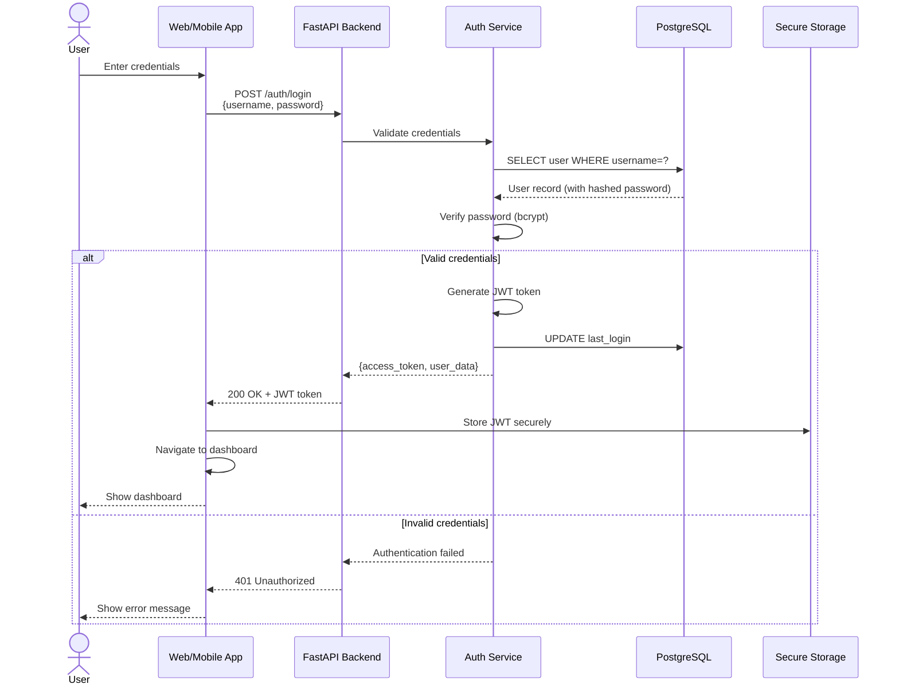
```mermaid
sequenceDiagram
    actor User
    participant WebApp as Web/Mobile App
    participant API as FastAPI Backend
    participant Auth as Auth Service
    participant DB as PostgreSQL
    participant Cache as Secure Storage

    User->>WebApp: Enter credentials
    WebApp->>API: POST /auth/login<br/>{username, password}
    API->>Auth: Validate credentials
    Auth->>DB: SELECT user WHERE username=?
    DB-->>Auth: User record (with hashed password)
    Auth->>Auth: Verify password (bcrypt)

    alt Valid credentials
        Auth->>Auth: Generate JWT token
        Auth->>DB: UPDATE last_login
        Auth-->>API: {access_token, user_data}
        API-->>WebApp: 200 OK + JWT token
        WebApp->>Cache: Store JWT securely
        WebApp->>WebApp: Navigate to dashboard
        WebApp-->>User: Show dashboard
    else Invalid credentials
        Auth-->>API: Authentication failed
        API-->>WebApp: 401 Unauthorized
        WebApp-->>User: Show error message
    end
```

---

## 2. Add Transaction (Manual Entry) Sequence

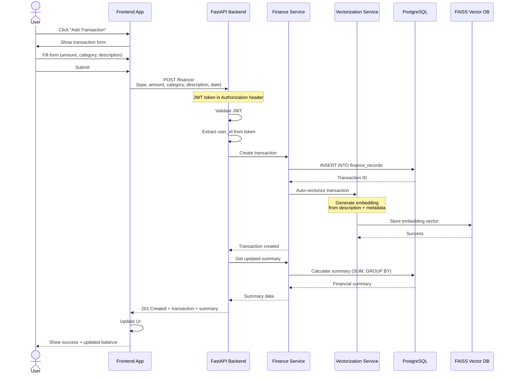
```mermaid
sequenceDiagram
    actor User
    participant App as Frontend App
    participant API as FastAPI Backend
    participant Finance as Finance Service
    participant Vector as Vectorization Service
    participant DB as PostgreSQL
    participant FAISS as FAISS Vector DB

    User->>App: Click "Add Transaction"
    App->>User: Show transaction form
    User->>App: Fill form (amount, category, description)
    User->>App: Submit

    App->>API: POST /finance/<br/>{type, amount, category, description, date}
    Note over API: JWT token in Authorization header

    API->>API: Validate JWT
    API->>API: Extract user_id from token
    API->>Finance: Create transaction
    Finance->>DB: INSERT INTO finance_records
    DB-->>Finance: Transaction ID

    Finance->>Vector: Auto-vectorize transaction
    Note over Vector: Generate embedding<br/>from description + metadata
    Vector->>FAISS: Store embedding vector
    FAISS-->>Vector: Success

    Finance-->>API: Transaction created
    API->>Finance: Get updated summary
    Finance->>DB: Calculate summary (SUM, GROUP BY)
    DB-->>Finance: Financial summary
    Finance-->>API: Summary data

    API-->>App: 201 Created + transaction + summary
    App->>App: Update UI
    App-->>User: Show success + updated balance
```

---

## 3. Add Transaction (Voice Input) Sequence

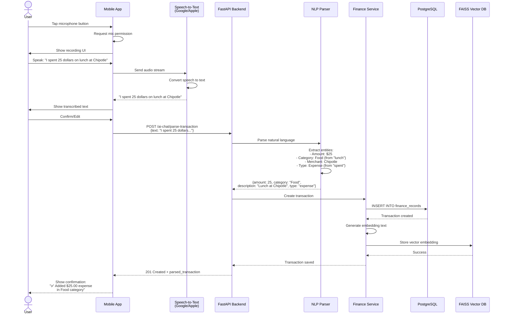
```mermaid
sequenceDiagram
    actor User
    participant App as Mobile App
    participant STT as Speech-to-Text<br/>(Google/Apple)
    participant API as FastAPI Backend
    participant NLP as NLP Parser
    participant Finance as Finance Service
    participant DB as PostgreSQL
    participant FAISS as FAISS Vector DB

    User->>App: Tap microphone button
    App->>App: Request mic permission
    App->>User: Show recording UI
    User->>App: Speak: "I spent 25 dollars on lunch at Chipotle"

    App->>STT: Send audio stream
    STT->>STT: Convert speech to text
    STT-->>App: "I spent 25 dollars on lunch at Chipotle"

    App->>User: Show transcribed text
    User->>App: Confirm/Edit

    App->>API: POST /ai-chat/parse-transaction<br/>{text: "I spent 25 dollars..."}
    API->>NLP: Parse natural language

    NLP->>NLP: Extract entities:<br/>- Amount: $25<br/>- Category: Food (from "lunch")<br/>- Merchant: Chipotle<br/>- Type: Expense (from "spent")

    NLP-->>API: {amount: 25, category: "Food",<br/>description: "Lunch at Chipotle", type: "expense"}

    API->>Finance: Create transaction
    Finance->>DB: INSERT INTO finance_records
    DB-->>Finance: Transaction created

    Finance->>Finance: Generate embedding text
    Finance->>FAISS: Store vector embedding
    FAISS-->>Finance: Success

    Finance-->>API: Transaction saved
    API-->>App: 201 Created + parsed_transaction

    App-->>User: Show confirmation:<br/>"✅ Added $25.00 expense<br/>in Food category"
```

---

## 4. Receipt OCR Processing Sequence

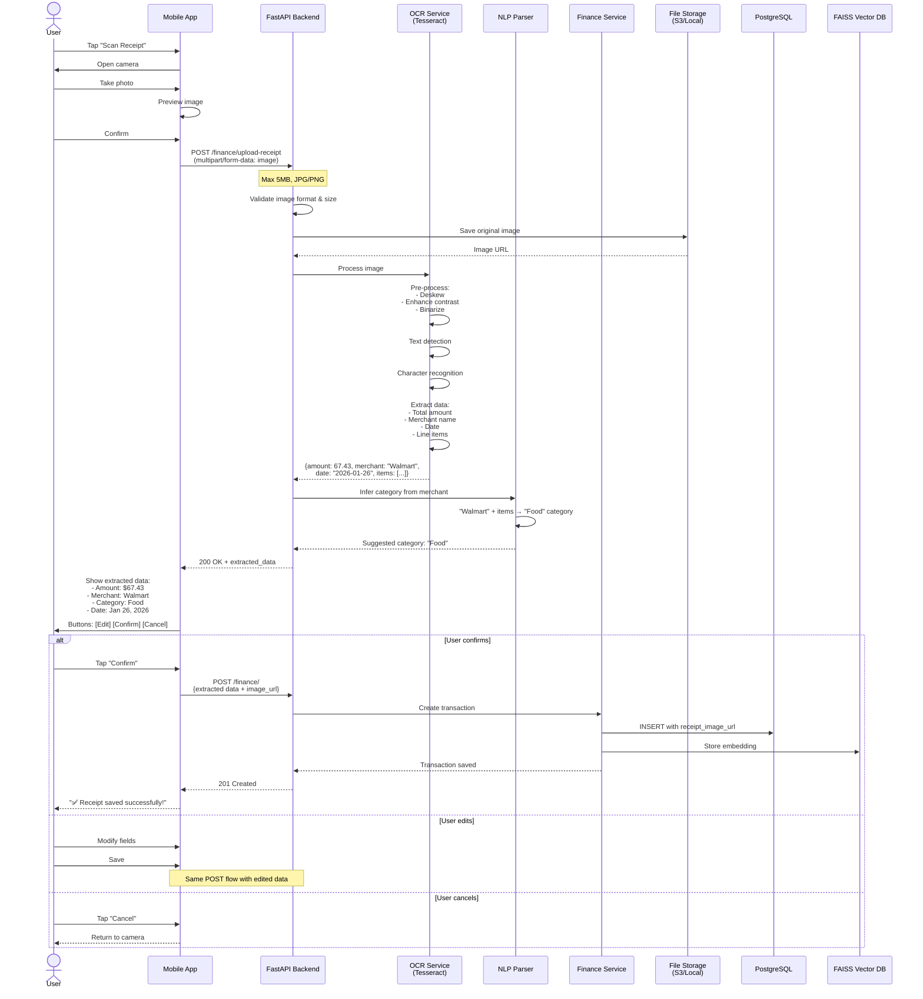
```mermaid
sequenceDiagram
    actor User
    participant App as Mobile App
    participant API as FastAPI Backend
    participant OCR as OCR Service<br/>(Tesseract)
    participant NLP as NLP Parser
    participant Finance as Finance Service
    participant Storage as File Storage<br/>(S3/Local)
    participant DB as PostgreSQL
    participant FAISS as FAISS Vector DB

    User->>App: Tap "Scan Receipt"
    App->>User: Open camera
    User->>App: Take photo
    App->>App: Preview image
    User->>App: Confirm

    App->>API: POST /finance/upload-receipt<br/>(multipart/form-data: image)
    Note over API: Max 5MB, JPG/PNG

    API->>API: Validate image format & size
    API->>Storage: Save original image
    Storage-->>API: Image URL

    API->>OCR: Process image
    OCR->>OCR: Pre-process:<br/>- Deskew<br/>- Enhance contrast<br/>- Binarize
    OCR->>OCR: Text detection
    OCR->>OCR: Character recognition
    OCR->>OCR: Extract data:<br/>- Total amount<br/>- Merchant name<br/>- Date<br/>- Line items

    OCR-->>API: {amount: 67.43, merchant: "Walmart",<br/>date: "2026-01-26", items: [...]}

    API->>NLP: Infer category from merchant
    NLP->>NLP: "Walmart" + items → "Food" category
    NLP-->>API: Suggested category: "Food"

    API-->>App: 200 OK + extracted_data

    App->>User: Show extracted data:<br/>- Amount: $67.43<br/>- Merchant: Walmart<br/>- Category: Food<br/>- Date: Jan 26, 2026<br/><br/>Buttons: [Edit] [Confirm] [Cancel]

    alt User confirms
        User->>App: Tap "Confirm"
        App->>API: POST /finance/<br/>{extracted data + image_url}
        API->>Finance: Create transaction
        Finance->>DB: INSERT with receipt_image_url
        Finance->>FAISS: Store embedding
        Finance-->>API: Transaction saved
        API-->>App: 201 Created
        App-->>User: "✅ Receipt saved successfully!"
    else User edits
        User->>App: Modify fields
        User->>App: Save
        Note over App,API: Same POST flow with edited data
    else User cancels
        User->>App: Tap "Cancel"
        App-->>User: Return to camera
    end
```

---

## 5. AI Chat Conversation Sequence

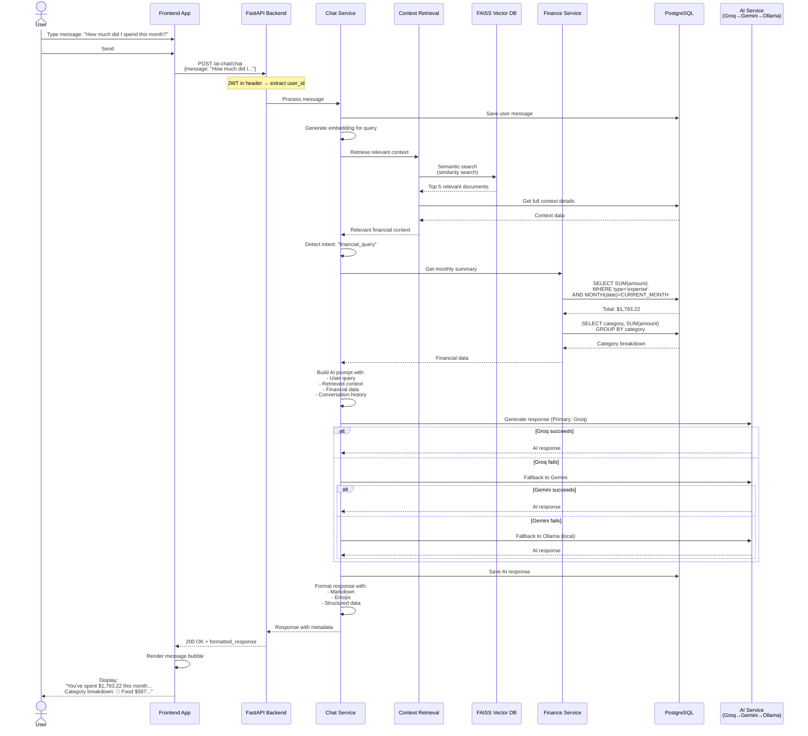
```mermaid
sequenceDiagram
    actor User
    participant App as Frontend App
    participant API as FastAPI Backend
    participant Chat as Chat Service
    participant Context as Context Retrieval
    participant FAISS as FAISS Vector DB
    participant Finance as Finance Service
    participant DB as PostgreSQL
    participant AI as AI Service<br/>(Groq→Gemini→Ollama)

    User->>App: Type message: "How much did I spend this month?"
    User->>App: Send

    App->>API: POST /ai-chat/chat<br/>{message: "How much did I..."}
    Note over API: JWT in header → extract user_id

    API->>Chat: Process message
    Chat->>DB: Save user message

    Chat->>Chat: Generate embedding for query
    Chat->>Context: Retrieve relevant context
    Context->>FAISS: Semantic search<br/>(similarity search)
    FAISS-->>Context: Top 5 relevant documents
    Context->>DB: Get full context details
    DB-->>Context: Context data
    Context-->>Chat: Relevant financial context

    Chat->>Chat: Detect intent: "financial_query"
    Chat->>Finance: Get monthly summary
    Finance->>DB: SELECT SUM(amount)<br/>WHERE type='expense'<br/>AND MONTH(date)=CURRENT_MONTH
    DB-->>Finance: Total: $1,793.22
    Finance->>DB: SELECT category, SUM(amount)<br/>GROUP BY category
    DB-->>Finance: Category breakdown
    Finance-->>Chat: Financial data

    Chat->>Chat: Build AI prompt with:<br/>- User query<br/>- Retrieved context<br/>- Financial data<br/>- Conversation history

    Chat->>AI: Generate response (Primary: Groq)

    alt Groq succeeds
        AI-->>Chat: AI response
    else Groq fails
        Chat->>AI: Fallback to Gemini
        alt Gemini succeeds
            AI-->>Chat: AI response
        else Gemini fails
            Chat->>AI: Fallback to Ollama (local)
            AI-->>Chat: AI response
        end
    end

    Chat->>DB: Save AI response
    Chat->>Chat: Format response with:<br/>- Markdown<br/>- Emojis<br/>- Structured data

    Chat-->>API: Response with metadata
    API-->>App: 200 OK + formatted_response

    App->>App: Render message bubble
    App-->>User: Display:<br/>"You've spent $1,793.22 this month...<br/>Category breakdown: 🍔 Food $587..."
```

---

## 6. Budget Alert System Sequence

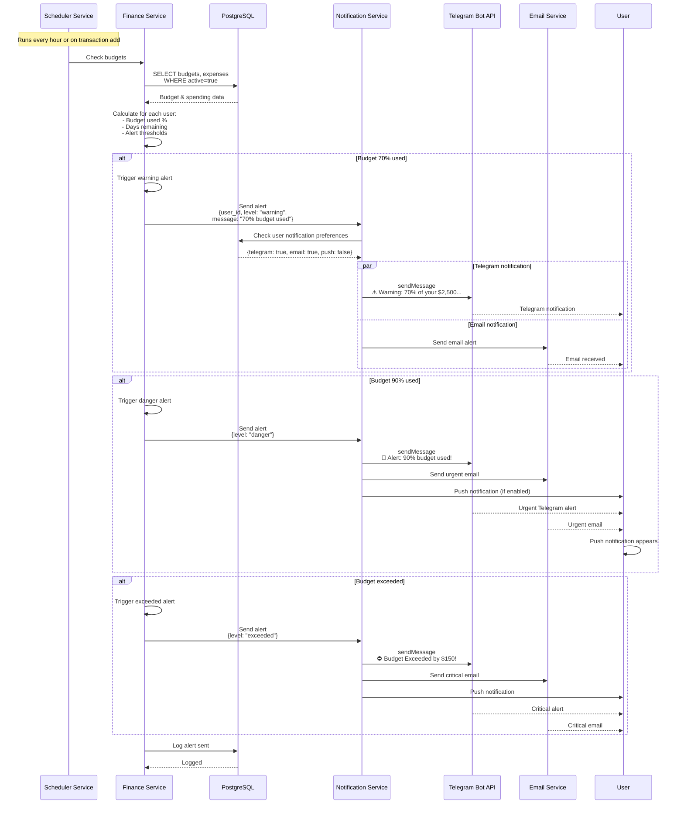
```mermaid
sequenceDiagram
    participant Scheduler as Scheduler Service
    participant Finance as Finance Service
    participant DB as PostgreSQL
    participant Notif as Notification Service
    participant Telegram as Telegram Bot API
    participant Email as Email Service
    participant User

    Note over Scheduler: Runs every hour or on transaction add

    Scheduler->>Finance: Check budgets
    Finance->>DB: SELECT budgets, expenses<br/>WHERE active=true
    DB-->>Finance: Budget & spending data

    Finance->>Finance: Calculate for each user:<br/>- Budget used %<br/>- Days remaining<br/>- Alert thresholds

    alt Budget 70% used
        Finance->>Finance: Trigger warning alert
        Finance->>Notif: Send alert<br/>{user_id, level: "warning",<br/>message: "70% budget used"}

        Notif->>DB: Check user notification preferences
        DB-->>Notif: {telegram: true, email: true, push: false}

        par Telegram notification
            Notif->>Telegram: sendMessage<br/>⚠️ Warning: 70% of your $2,500...
            Telegram-->>User: Telegram notification
        and Email notification
            Notif->>Email: Send email alert
            Email-->>User: Email received
        end
    end

    alt Budget 90% used
        Finance->>Finance: Trigger danger alert
        Finance->>Notif: Send alert<br/>{level: "danger"}

        Notif->>Telegram: sendMessage<br/>🚨 Alert: 90% budget used!
        Notif->>Email: Send urgent email
        Notif->>User: Push notification (if enabled)

        Telegram-->>User: Urgent Telegram alert
        Email-->>User: Urgent email
        User->>User: Push notification appears
    end

    alt Budget exceeded
        Finance->>Finance: Trigger exceeded alert
        Finance->>Notif: Send alert<br/>{level: "exceeded"}

        Notif->>Telegram: sendMessage<br/>⛔ Budget Exceeded by $150!
        Notif->>Email: Send critical email
        Notif->>User: Push notification

        Telegram-->>User: Critical alert
        Email-->>User: Critical email
    end

    Finance->>DB: Log alert sent
    DB-->>Finance: Logged
```

---

## 7. Telegram Bot Integration Sequence

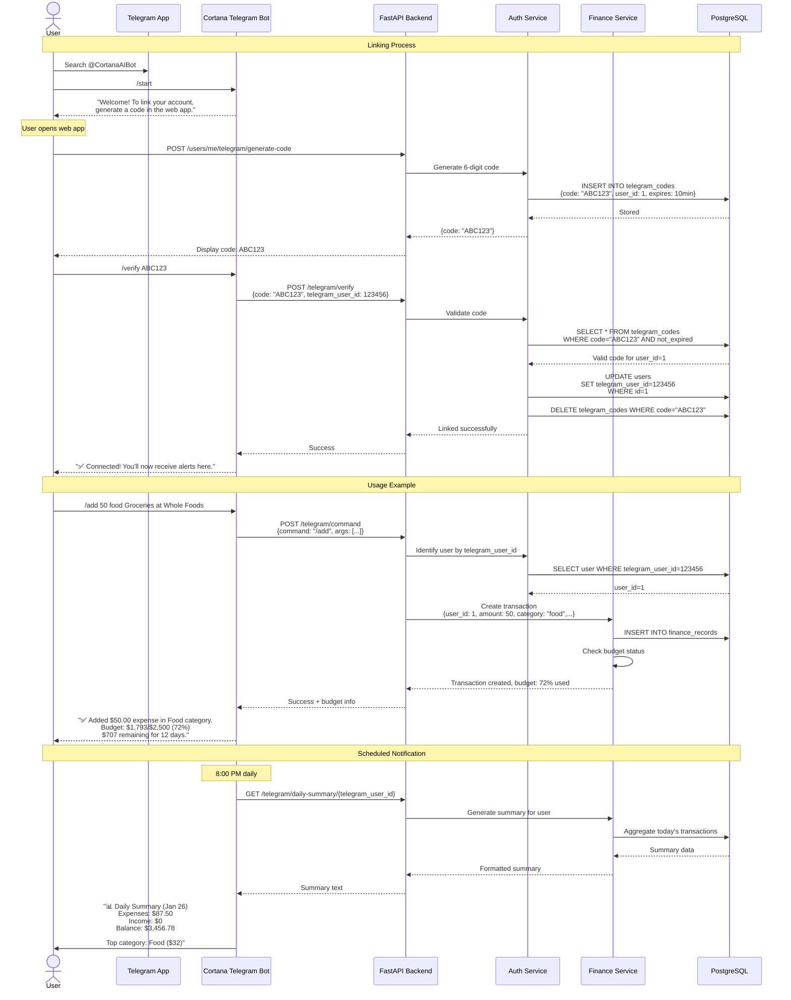
```mermaid
sequenceDiagram
    actor User
    participant Telegram as Telegram App
    participant Bot as Cortana Telegram Bot
    participant API as FastAPI Backend
    participant Auth as Auth Service
    participant Finance as Finance Service
    participant DB as PostgreSQL

    Note over User,DB: Linking Process

    User->>Telegram: Search @CortanaAIBot
    User->>Bot: /start
    Bot-->>User: "Welcome! To link your account,<br/>generate a code in the web app."

    Note over User: User opens web app
    User->>API: POST /users/me/telegram/generate-code
    API->>Auth: Generate 6-digit code
    Auth->>DB: INSERT INTO telegram_codes<br/>{code: "ABC123", user_id: 1, expires: 10min}
    DB-->>Auth: Stored
    Auth-->>API: {code: "ABC123"}
    API-->>User: Display code: ABC123

    User->>Bot: /verify ABC123
    Bot->>API: POST /telegram/verify<br/>{code: "ABC123", telegram_user_id: 123456}
    API->>Auth: Validate code
    Auth->>DB: SELECT * FROM telegram_codes<br/>WHERE code="ABC123" AND not_expired
    DB-->>Auth: Valid code for user_id=1
    Auth->>DB: UPDATE users<br/>SET telegram_user_id=123456<br/>WHERE id=1
    Auth->>DB: DELETE telegram_codes WHERE code="ABC123"
    Auth-->>API: Linked successfully
    API-->>Bot: Success
    Bot-->>User: "✅ Connected! You'll now receive alerts here."

    Note over User,DB: Usage Example

    User->>Bot: /add 50 food Groceries at Whole Foods
    Bot->>API: POST /telegram/command<br/>{command: "/add", args: [...]}
    API->>Auth: Identify user by telegram_user_id
    Auth->>DB: SELECT user WHERE telegram_user_id=123456
    DB-->>Auth: user_id=1
    API->>Finance: Create transaction<br/>{user_id: 1, amount: 50, category: "food",...}
    Finance->>DB: INSERT INTO finance_records
    Finance->>Finance: Check budget status
    Finance-->>API: Transaction created, budget: 72% used
    API-->>Bot: Success + budget info
    Bot-->>User: "✅ Added $50.00 expense in Food category.<br/>Budget: $1,793/$2,500 (72%)<br/>$707 remaining for 12 days."

    Note over User,DB: Scheduled Notification

    Note over Bot: 8:00 PM daily
    Bot->>API: GET /telegram/daily-summary/{telegram_user_id}
    API->>Finance: Generate summary for user
    Finance->>DB: Aggregate today's transactions
    DB-->>Finance: Summary data
    Finance-->>API: Formatted summary
    API-->>Bot: Summary text
    Bot->>User: "📊 Daily Summary (Jan 26)<br/>Expenses: $87.50<br/>Income: $0<br/>Balance: $3,456.78<br/><br/>Top category: Food ($32)"
```

---

## 8. News Aggregation & Delivery Sequence

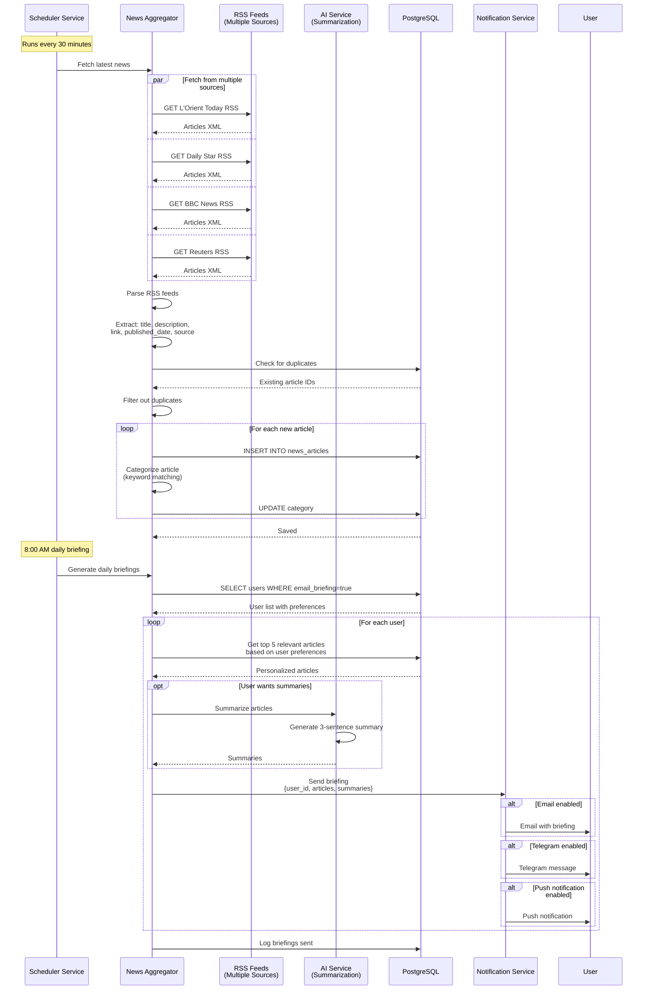
```mermaid
sequenceDiagram
    participant Scheduler as Scheduler Service
    participant News as News Aggregator
    participant RSS as RSS Feeds<br/>(Multiple Sources)
    participant AI as AI Service<br/>(Summarization)
    participant DB as PostgreSQL
    participant Notif as Notification Service
    participant User

    Note over Scheduler: Runs every 30 minutes

    Scheduler->>News: Fetch latest news

    par Fetch from multiple sources
        News->>RSS: GET L'Orient Today RSS
        RSS-->>News: Articles XML
    and
        News->>RSS: GET Daily Star RSS
        RSS-->>News: Articles XML
    and
        News->>RSS: GET BBC News RSS
        RSS-->>News: Articles XML
    and
        News->>RSS: GET Reuters RSS
        RSS-->>News: Articles XML
    end

    News->>News: Parse RSS feeds
    News->>News: Extract: title, description,<br/>link, published_date, source

    News->>DB: Check for duplicates
    DB-->>News: Existing article IDs
    News->>News: Filter out duplicates

    loop For each new article
        News->>DB: INSERT INTO news_articles
        News->>News: Categorize article<br/>(keyword matching)
        News->>DB: UPDATE category
    end

    DB-->>News: Saved

    Note over Scheduler: 8:00 AM daily briefing

    Scheduler->>News: Generate daily briefings
    News->>DB: SELECT users WHERE email_briefing=true
    DB-->>News: User list with preferences

    loop For each user
        News->>DB: Get top 5 relevant articles<br/>based on user preferences
        DB-->>News: Personalized articles

        opt User wants summaries
            News->>AI: Summarize articles
            AI->>AI: Generate 3-sentence summary
            AI-->>News: Summaries
        end

        News->>Notif: Send briefing<br/>{user_id, articles, summaries}

        alt Email enabled
            Notif->>User: Email with briefing
        end

        alt Telegram enabled
            Notif->>User: Telegram message
        end

        alt Push notification enabled
            Notif->>User: Push notification
        end
    end

    News->>DB: Log briefings sent
```

---

## 9. Workout Logging & Progress Sequence

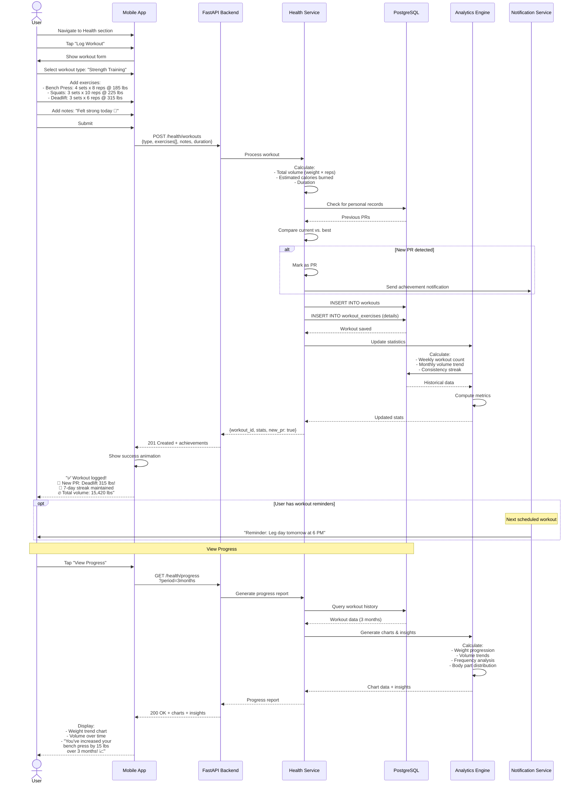
```mermaid
sequenceDiagram
    actor User
    participant App as Mobile App
    participant API as FastAPI Backend
    participant Health as Health Service
    participant DB as PostgreSQL
    participant Analytics as Analytics Engine
    participant Notif as Notification Service

    User->>App: Navigate to Health section
    User->>App: Tap "Log Workout"
    App->>User: Show workout form

    User->>App: Select workout type: "Strength Training"
    User->>App: Add exercises:<br/>- Bench Press: 4 sets x 8 reps @ 185 lbs<br/>- Squats: 3 sets x 10 reps @ 225 lbs<br/>- Deadlift: 3 sets x 6 reps @ 315 lbs
    User->>App: Add notes: "Felt strong today 💪"
    User->>App: Submit

    App->>API: POST /health/workouts<br/>{type, exercises[], notes, duration}

    API->>Health: Process workout
    Health->>Health: Calculate:<br/>- Total volume (weight × reps)<br/>- Estimated calories burned<br/>- Duration

    Health->>DB: Check for personal records
    DB-->>Health: Previous PRs
    Health->>Health: Compare current vs. best

    alt New PR detected
        Health->>Health: Mark as PR
        Health->>Notif: Send achievement notification
    end

    Health->>DB: INSERT INTO workouts
    Health->>DB: INSERT INTO workout_exercises (details)
    DB-->>Health: Workout saved

    Health->>Analytics: Update statistics
    Analytics->>DB: Calculate:<br/>- Weekly workout count<br/>- Monthly volume trend<br/>- Consistency streak
    DB-->>Analytics: Historical data
    Analytics->>Analytics: Compute metrics
    Analytics-->>Health: Updated stats

    Health-->>API: {workout_id, stats, new_pr: true}
    API-->>App: 201 Created + achievements

    App->>App: Show success animation
    App-->>User: "✅ Workout logged!<br/>🎉 New PR: Deadlift 315 lbs!<br/>💪 7-day streak maintained<br/>🔥 Total volume: 15,420 lbs"

    opt User has workout reminders
        Note over Notif: Next scheduled workout
        Notif->>User: "Reminder: Leg day tomorrow at 6 PM"
    end

    Note over User,DB: View Progress

    User->>App: Tap "View Progress"
    App->>API: GET /health/progress<br/>?period=3months
    API->>Health: Generate progress report
    Health->>DB: Query workout history
    DB-->>Health: Workout data (3 months)
    Health->>Analytics: Generate charts & insights
    Analytics->>Analytics: Calculate:<br/>- Weight progression<br/>- Volume trends<br/>- Frequency analysis<br/>- Body part distribution
    Analytics-->>Health: Chart data + insights
    Health-->>API: Progress report
    API-->>App: 200 OK + charts + insights
    App-->>User: Display:<br/>- Weight trend chart<br/>- Volume over time<br/>- "You've increased your<br/>  bench press by 15 lbs<br/>  over 3 months! 📈"
```

---

# Class Diagrams

## 1. Database Schema - Core Models

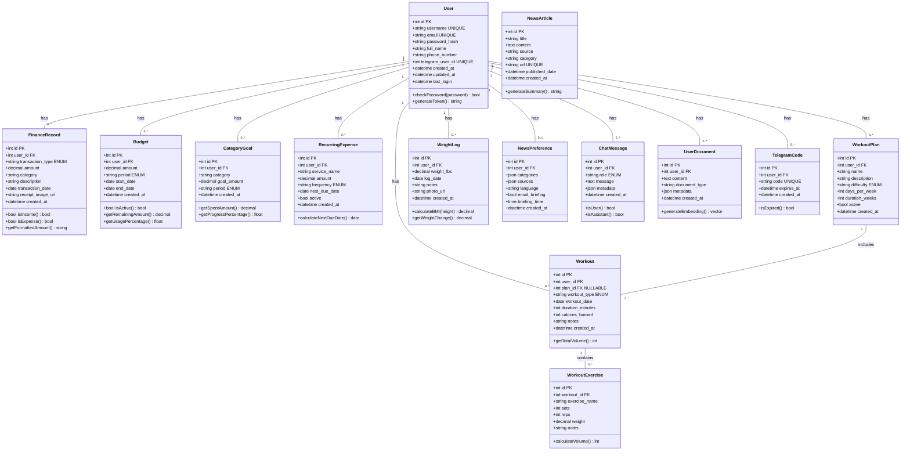
```mermaid
classDiagram
    class User {
        +int id PK
        +string username UNIQUE
        +string email UNIQUE
        +string password_hash
        +string full_name
        +string phone_number
        +int telegram_user_id UNIQUE
        +datetime created_at
        +datetime updated_at
        +datetime last_login
        +checkPassword(password) bool
        +generateToken() string
    }

    class FinanceRecord {
        +int id PK
        +int user_id FK
        +string transaction_type ENUM
        +decimal amount
        +string category
        +string description
        +date transaction_date
        +string receipt_image_url
        +datetime created_at
        +bool isIncome() bool
        +bool isExpense() bool
        +getFormattedAmount() string
    }

    class Budget {
        +int id PK
        +int user_id FK
        +decimal amount
        +string period ENUM
        +date start_date
        +date end_date
        +datetime created_at
        +bool isActive() bool
        +getRemainingAmount() decimal
        +getUsagePercentage() float
    }

    class CategoryGoal {
        +int id PK
        +int user_id FK
        +string category
        +decimal goal_amount
        +string period ENUM
        +datetime created_at
        +getSpentAmount() decimal
        +getProgressPercentage() float
    }

    class RecurringExpense {
        +int id PK
        +int user_id FK
        +string service_name
        +decimal amount
        +string frequency ENUM
        +date next_due_date
        +bool active
        +datetime created_at
        +calculateNextDueDate() date
    }

    class WorkoutPlan {
        +int id PK
        +int user_id FK
        +string name
        +string description
        +string difficulty ENUM
        +int days_per_week
        +int duration_weeks
        +bool active
        +datetime created_at
    }

    class Workout {
        +int id PK
        +int user_id FK
        +int plan_id FK NULLABLE
        +string workout_type ENUM
        +date workout_date
        +int duration_minutes
        +int calories_burned
        +string notes
        +datetime created_at
        +getTotalVolume() int
    }

    class WorkoutExercise {
        +int id PK
        +int workout_id FK
        +string exercise_name
        +int sets
        +int reps
        +decimal weight
        +string notes
        +calculateVolume() int
    }

    class WeightLog {
        +int id PK
        +int user_id FK
        +decimal weight_lbs
        +date log_date
        +string notes
        +string photo_url
        +datetime created_at
        +calculateBMI(height) decimal
        +getWeightChange() decimal
    }

    class NewsArticle {
        +int id PK
        +string title
        +text content
        +string source
        +string category
        +string url UNIQUE
        +datetime published_date
        +datetime created_at
        +generateSummary() string
    }

    class NewsPreference {
        +int id PK
        +int user_id FK
        +json categories
        +json sources
        +string language
        +bool email_briefing
        +time briefing_time
        +datetime created_at
    }

    class ChatMessage {
        +int id PK
        +int user_id FK
        +string role ENUM
        +text message
        +json metadata
        +datetime created_at
        +isUser() bool
        +isAssistant() bool
    }

    class UserDocument {
        +int id PK
        +int user_id FK
        +text content
        +string document_type
        +json metadata
        +datetime created_at
        +generateEmbedding() vector
    }

    class TelegramCode {
        +int id PK
        +int user_id FK
        +string code UNIQUE
        +datetime expires_at
        +datetime created_at
        +isExpired() bool
    }

    User "1" -- "0..*" FinanceRecord : has
    User "1" -- "0..*" Budget : has
    User "1" -- "0..*" CategoryGoal : has
    User "1" -- "0..*" RecurringExpense : has
    User "1" -- "0..*" WorkoutPlan : has
    User "1" -- "0..*" Workout : has
    User "1" -- "0..*" WeightLog : has
    User "1" -- "0..1" NewsPreference : has
    User "1" -- "0..*" ChatMessage : has
    User "1" -- "0..*" UserDocument : has
    User "1" -- "0..*" TelegramCode : has

    WorkoutPlan "1" -- "0..*" Workout : includes
    Workout "1" -- "0..*" WorkoutExercise : contains
```

---

## 2. Backend Services Architecture

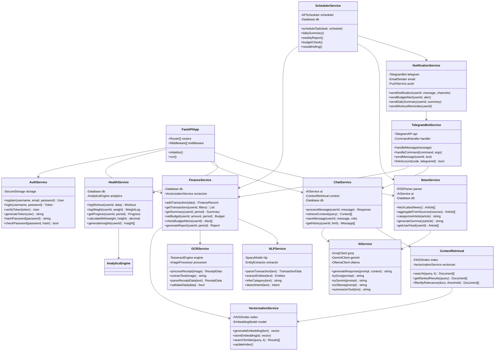
```mermaid
classDiagram
    class FastAPIApp {
        +Router[] routers
        +Middleware[] middleware
        +initialize()
        +run()
    }

    class AuthService {
        -SecureStorage storage
        +register(username, email, password) User
        +login(username, password) Token
        +verifyToken(token) User
        +generateToken(user) string
        +hashPassword(password) string
        +checkPassword(password, hash) bool
    }

    class FinanceService {
        -Database db
        -VectorizationService vectorizer
        +addTransaction(data) FinanceRecord
        +getTransactions(userId, filters) List
        +getSummary(userId, period) Summary
        +setBudget(userId, amount, period) Budget
        +checkBudgetAlerts(userId) Alert[]
        +generateReport(userId, period) Report
    }

    class VectorizationService {
        -FAISSIndex index
        -EmbeddingModel model
        +generateEmbedding(text) vector
        +storeEmbedding(id, vector)
        +searchSimilar(query, k) Results[]
        +updateIndex()
    }

    class OCRService {
        -TesseractEngine engine
        -ImageProcessor processor
        +processReceipt(image) ReceiptData
        +extractText(image) string
        +parseReceiptData(text) ReceiptData
        +validateData(data) bool
    }

    class NLPService {
        -SpacyModel nlp
        -EntityExtractor extractor
        +parseTransaction(text) TransactionData
        +extractEntities(text) Entities
        +inferCategory(text) string
        +detectIntent(text) Intent
    }

    class AIService {
        -GroqClient groq
        -GeminiClient gemini
        -OllamaClient ollama
        +generateResponse(prompt, context) string
        -tryGroq(prompt) string
        -tryGemini(prompt) string
        -tryOllama(prompt) string
        +summarizeText(text) string
    }

    class ChatService {
        -AIService ai
        -ContextRetrieval context
        -Database db
        +processMessage(userId, message) Response
        +retrieveContext(query) Context[]
        +saveMessage(userId, message, role)
        +getHistory(userId, limit) Message[]
    }

    class ContextRetrieval {
        -FAISSIndex index
        -VectorizationService vectorizer
        +search(query, k) Document[]
        +getRankedResults(query) Document[]
        +filterByRelevance(docs, threshold) Document[]
    }

    class HealthService {
        -Database db
        -AnalyticsEngine analytics
        +logWorkout(userId, data) Workout
        +logWeight(userId, weight) WeightLog
        +getProgress(userId, period) Progress
        +calculateBMI(weight, height) decimal
        +generateInsights(userId) Insight[]
    }

    class NewsService {
        -RSSParser parser
        -AIService ai
        -Database db
        +fetchLatestNews() Article[]
        +aggregateFromSources(sources) Article[]
        +categorizeArticle(article) string
        +generateSummary(article) string
        +getUserFeed(userId) Article[]
    }

    class SchedulerService {
        -APScheduler scheduler
        -Database db
        +scheduleTask(task, schedule)
        +dailySummary()
        +weeklyReport()
        +budgetCheck()
        +newsBriefing()
    }

    class NotificationService {
        -TelegramBot telegram
        -EmailSender email
        -PushService push
        +sendNotification(userId, message, channels)
        +sendBudgetAlert(userId, alert)
        +sendDailySummary(userId, summary)
        +sendWorkoutReminder(userId)
    }

    class TelegramBotService {
        -TelegramAPI api
        -CommandHandler handler
        +handleMessage(message)
        +handleCommand(command, args)
        +sendMessage(userId, text)
        +linkAccount(code, telegramId) bool
    }

    FastAPIApp --> AuthService
    FastAPIApp --> FinanceService
    FastAPIApp --> ChatService
    FastAPIApp --> HealthService
    FastAPIApp --> NewsService

    FinanceService --> VectorizationService
    FinanceService --> OCRService
    FinanceService --> NLPService

    ChatService --> AIService
    ChatService --> ContextRetrieval

    ContextRetrieval --> VectorizationService

    HealthService --> AnalyticsEngine

    NewsService --> AIService

    SchedulerService --> FinanceService
    SchedulerService --> NewsService
    SchedulerService --> NotificationService

    NotificationService --> TelegramBotService

    TelegramBotService --> FinanceService
    TelegramBotService --> ChatService
```

---

## 3. API Endpoints Structure

```mermaid
classDiagram
    class APIRouter {
        <<interface>>
        +prefix: string
        +tags: string[]
        +dependencies: Dependency[]
    }

    class AuthRouter {
        +prefix: "/auth"
        +POST login(credentials) Token
        +POST register(userData) User
        +POST refresh(token) Token
        +GET me() User
    }

    class UsersRouter {
        +prefix: "/users"
        +GET me() User
        +PUT me(updates) User
        +POST me/change-password(data) Success
        +DELETE me() Success
        +GET me/telegram/status() TelegramStatus
        +POST me/telegram/generate-code() Code
        +DELETE me/telegram/unlink() Success
    }

    class FinanceRouter {
        +prefix: "/finance"
        +GET /user/{userId} List~FinanceRecord~
        +POST / (data) FinanceRecord
        +PUT /{recordId}(data) FinanceRecord
        +DELETE /{recordId}() Success
        +GET /summary/{userId} FinanceSummary
        +POST /upload-receipt(image) ReceiptData
        +GET /export/{userId} CSV
    }

    class BudgetRouter {
        +prefix: "/budget"
        +GET /{userId} Budget
        +POST / (data) Budget
        +PUT /{budgetId}(data) Budget
        +DELETE /{budgetId}() Success
        +GET /category-goals/{userId} List~CategoryGoal~
        +POST /category-goal(data) CategoryGoal
        +PUT /category-goal/{goalId}(data) CategoryGoal
    }

    class AIChatRouter {
        +prefix: "/ai-chat"
        +POST /chat(message) ChatResponse
        +GET /history/{userId} List~ChatMessage~
        +DELETE /history/{userId}() Success
        +POST /parse-transaction(text) TransactionData
    }

    class HealthRouter {
        +prefix: "/health"
        +GET /profile/{userId} HealthProfile
        +POST /profile(data) HealthProfile
        +GET /workouts/{userId} List~Workout~
        +POST /workouts(data) Workout
        +GET /workouts/{workoutId} Workout
        +DELETE /workouts/{workoutId}() Success
        +POST /weight(data) WeightLog
        +GET /weight/{userId} List~WeightLog~
        +GET /progress/{userId} ProgressData
    }

    class NewsRouter {
        +prefix: "/news"
        +GET / (filters) List~NewsArticle~
        +GET /{articleId} NewsArticle
        +POST /preferences(data) NewsPreference
        +GET /preferences/{userId} NewsPreference
        +POST /summarize/{articleId}() Summary
        +GET /briefing/{userId} Briefing
    }

    class TelegramRouter {
        +prefix: "/telegram"
        +POST /webhook(update) Success
        +POST /verify(code, telegramId) Success
        +POST /command(command, args) Response
        +GET /daily-summary/{telegramId} Summary
    }

    class SchedulerRouter {
        +prefix: "/scheduler"
        +POST /trigger-reminder(userId) Success
        +POST /trigger-summary(userId) Success
        +GET /preferences/{userId} SchedulePrefs
        +PUT /preferences/{userId}(data) SchedulePrefs
    }

    APIRouter <|.. AuthRouter
    APIRouter <|.. UsersRouter
    APIRouter <|.. FinanceRouter
    APIRouter <|.. BudgetRouter
    APIRouter <|.. AIChatRouter
    APIRouter <|.. HealthRouter
    APIRouter <|.. NewsRouter
    APIRouter <|.. TelegramRouter
    APIRouter <|.. SchedulerRouter
```

---

## 4. Frontend Architecture (React + Flutter)

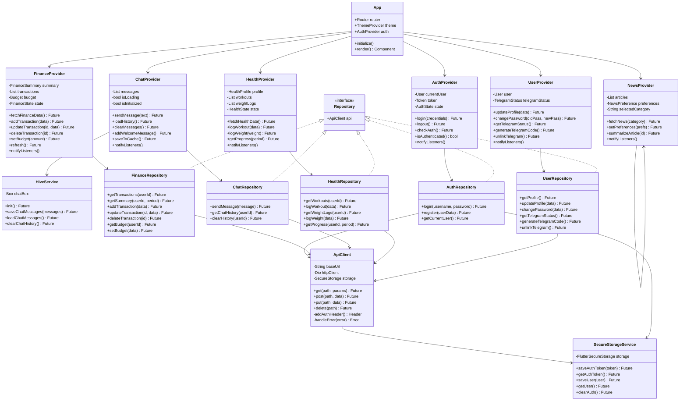
```mermaid
classDiagram
    class App {
        +Router router
        +ThemeProvider theme
        +AuthProvider auth
        +initialize()
        +render() Component
    }

    class AuthProvider {
        -User currentUser
        -Token token
        -AuthState state
        +login(credentials) Future
        +logout() Future
        +checkAuth() Future
        +isAuthenticated() bool
        +notifyListeners()
    }

    class FinanceProvider {
        -FinanceSummary summary
        -List transactions
        -Budget budget
        -FinanceState state
        +fetchFinanceData() Future
        +addTransaction(data) Future
        +updateTransaction(id, data) Future
        +deleteTransaction(id) Future
        +setBudget(amount) Future
        +refresh() Future
        +notifyListeners()
    }

    class ChatProvider {
        -List messages
        -bool isLoading
        -bool isInitialized
        +sendMessage(text) Future
        +loadHistory() Future
        +clearMessages() Future
        +addWelcomeMessage() Future
        +saveToCache() Future
        +notifyListeners()
    }

    class HealthProvider {
        -HealthProfile profile
        -List workouts
        -List weightLogs
        -HealthState state
        +fetchHealthData() Future
        +logWorkout(data) Future
        +logWeight(weight) Future
        +getProgress(period) Future
        +notifyListeners()
    }

    class NewsProvider {
        -List articles
        -NewsPreference preferences
        -String selectedCategory
        +fetchNews(category) Future
        +setPreferences(prefs) Future
        +summarizeArticle(id) Future
        +notifyListeners()
    }

    class UserProvider {
        -User user
        -TelegramStatus telegramStatus
        +updateProfile(data) Future
        +changePassword(oldPass, newPass) Future
        +getTelegramStatus() Future
        +generateTelegramCode() Future
        +unlinkTelegram() Future
        +notifyListeners()
    }

    class ApiClient {
        -String baseUrl
        -Dio httpClient
        -SecureStorage storage
        +get(path, params) Future
        +post(path, data) Future
        +put(path, data) Future
        +delete(path) Future
        -addAuthHeader() Header
        -handleError(error) Error
    }

    class SecureStorageService {
        -FlutterSecureStorage storage
        +saveAuthToken(token) Future
        +getAuthToken() Future
        +saveUser(user) Future
        +getUser() Future
        +clearAuth() Future
    }

    class HiveService {
        -Box chatBox
        +init() Future
        +saveChatMessages(messages) Future
        +loadChatMessages() Future
        +clearChatHistory() Future
    }

    class Repository {
        <<interface>>
        +ApiClient api
    }

    class AuthRepository {
        +login(username, password) Future
        +register(userData) Future
        +getCurrentUser() Future
    }

    class FinanceRepository {
        +getTransactions(userId) Future
        +getSummary(userId, period) Future
        +addTransaction(data) Future
        +updateTransaction(id, data) Future
        +deleteTransaction(id) Future
        +getBudget(userId) Future
        +setBudget(data) Future
    }

    class ChatRepository {
        +sendMessage(message) Future
        +getChatHistory(userId) Future
        +clearHistory(userId) Future
    }

    class HealthRepository {
        +getWorkouts(userId) Future
        +logWorkout(data) Future
        +getWeightLogs(userId) Future
        +logWeight(data) Future
        +getProgress(userId, period) Future
    }

    class UserRepository {
        +getProfile() Future
        +updateProfile(data) Future
        +changePassword(data) Future
        +getTelegramStatus() Future
        +generateTelegramCode() Future
        +unlinkTelegram() Future
    }

    App --> AuthProvider
    App --> FinanceProvider
    App --> ChatProvider
    App --> HealthProvider
    App --> NewsProvider
    App --> UserProvider

    AuthProvider --> AuthRepository
    FinanceProvider --> FinanceRepository
    ChatProvider --> ChatRepository
    ChatProvider --> HiveService
    HealthProvider --> HealthRepository
    NewsProvider --> NewsProvider
    UserProvider --> UserRepository

    Repository <|.. AuthRepository
    Repository <|.. FinanceRepository
    Repository <|.. ChatRepository
    Repository <|.. HealthRepository
    Repository <|.. UserRepository

    AuthRepository --> ApiClient
    FinanceRepository --> ApiClient
    ChatRepository --> ApiClient
    HealthRepository --> ApiClient
    UserRepository --> ApiClient

    ApiClient --> SecureStorageService
    AuthRepository --> SecureStorageService
```

---

## 5. AI & Vector Database Architecture

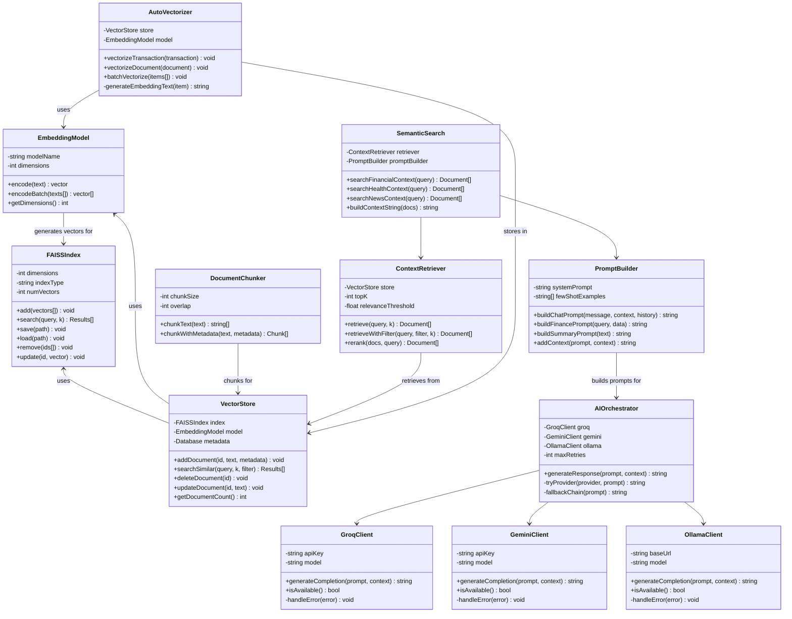
```mermaid
classDiagram
    class EmbeddingModel {
        -string modelName
        -int dimensions
        +encode(text) vector
        +encodeBatch(texts[]) vector[]
        +getDimensions() int
    }

    class FAISSIndex {
        -int dimensions
        -string indexType
        -int numVectors
        +add(vectors[]) void
        +search(query, k) Results[]
        +save(path) void
        +load(path) void
        +remove(ids[]) void
        +update(id, vector) void
    }

    class VectorStore {
        -FAISSIndex index
        -EmbeddingModel model
        -Database metadata
        +addDocument(id, text, metadata) void
        +searchSimilar(query, k, filter) Results[]
        +deleteDocument(id) void
        +updateDocument(id, text) void
        +getDocumentCount() int
    }

    class DocumentChunker {
        -int chunkSize
        -int overlap
        +chunkText(text) string[]
        +chunkWithMetadata(text, metadata) Chunk[]
    }

    class ContextRetriever {
        -VectorStore store
        -int topK
        -float relevanceThreshold
        +retrieve(query, k) Document[]
        +retrieveWithFilter(query, filter, k) Document[]
        +rerank(docs, query) Document[]
    }

    class GroqClient {
        -string apiKey
        -string model
        +generateCompletion(prompt, context) string
        +isAvailable() bool
        -handleError(error) void
    }

    class GeminiClient {
        -string apiKey
        -string model
        +generateCompletion(prompt, context) string
        +isAvailable() bool
        -handleError(error) void
    }

    class OllamaClient {
        -string baseUrl
        -string model
        +generateCompletion(prompt, context) string
        +isAvailable() bool
        -handleError(error) void
    }

    class AIOrchestrator {
        -GroqClient groq
        -GeminiClient gemini
        -OllamaClient ollama
        -int maxRetries
        +generateResponse(prompt, context) string
        -tryProvider(provider, prompt) string
        -fallbackChain(prompt) string
    }

    class PromptBuilder {
        -string systemPrompt
        -string[] fewShotExamples
        +buildChatPrompt(message, context, history) string
        +buildFinancePrompt(query, data) string
        +buildSummaryPrompt(text) string
        +addContext(prompt, context) string
    }

    class AutoVectorizer {
        -VectorStore store
        -EmbeddingModel model
        +vectorizeTransaction(transaction) void
        +vectorizeDocument(document) void
        +batchVectorize(items[]) void
        -generateEmbeddingText(item) string
    }

    class SemanticSearch {
        -ContextRetriever retriever
        -PromptBuilder promptBuilder
        +searchFinancialContext(query) Document[]
        +searchHealthContext(query) Document[]
        +searchNewsContext(query) Document[]
        +buildContextString(docs) string
    }

    EmbeddingModel --> FAISSIndex : generates vectors for
    FAISSIndex <-- VectorStore : uses
    EmbeddingModel <-- VectorStore : uses

    DocumentChunker --> VectorStore : chunks for
    ContextRetriever --> VectorStore : retrieves from

    AIOrchestrator --> GroqClient
    AIOrchestrator --> GeminiClient
    AIOrchestrator --> OllamaClient

    PromptBuilder --> AIOrchestrator : builds prompts for

    AutoVectorizer --> VectorStore : stores in
    AutoVectorizer --> EmbeddingModel : uses

    SemanticSearch --> ContextRetriever
    SemanticSearch --> PromptBuilder
```

---

# Usage Instructions

## Rendering Diagrams

### Option 1: Mermaid Live Editor (Easiest)
1. Visit https://mermaid.live/
2. Copy the Mermaid code from any diagram above
3. Paste into the editor
4. Click "Export" → Choose PNG or SVG
5. Download and insert into your report

### Option 2: VS Code
1. Install "Markdown Preview Mermaid Support" extension
2. Open this file in VS Code
3. Press `Ctrl+Shift+V` (Preview)
4. Right-click diagram → "Copy as Image"
5. Paste into your report

### Option 3: Command Line (Advanced)
```bash
# Install mermaid-cli
npm install -g @mermaid-js/mermaid-cli

# Convert diagram to image
mmdc -i diagram.mmd -o diagram.png
```

## Diagram Customization

You can customize colors, fonts, and styles by adding theme configuration:


```mermaid
%%{init: {'theme':'base', 'themeVariables': { 'primaryColor':'#667EEA'}}}%%
graph TB
    ...
```

## Export Quality Settings

For high-quality exports in Mermaid Live:
- Format: PNG or SVG
- Quality: High (300 DPI for PNG)
- Transparent background: Optional
- Scale: 2x or 3x for better clarity

---

# Diagram Summary

This file contains **25+ comprehensive diagrams**:

## Data Flow Diagrams (5)
1. Context Diagram (Level 0)
2. Level 1 DFD - Main System
3. Level 2 DFD - Finance Module
4. Level 2 DFD - AI Chat Module
5. Level 2 DFD - Health Module

## Sequence Diagrams (9)
1. User Authentication Flow
2. Add Transaction (Manual Entry)
3. Add Transaction (Voice Input)
4. Receipt OCR Processing
5. AI Chat Conversation
6. Budget Alert System
7. Telegram Bot Integration
8. News Aggregation & Delivery
9. Workout Logging & Progress

## Class Diagrams (5)
1. Database Schema - Core Models (15 classes)
2. Backend Services Architecture (15 services)
3. API Endpoints Structure (8 routers)
4. Frontend Architecture (12 classes)
5. AI & Vector Database Architecture (11 classes)

---

**Total Diagrams:** 25 comprehensive diagrams covering all aspects of the Cortana AI Assistant system

**Ready for:** Graduation report inclusion, presentations, documentation

**Format:** Mermaid syntax (easily convertible to images)
