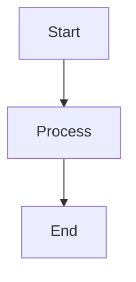

# 📚 Cortana AI Assistant - Graduation Report Files

## 🎯 Quick Start

**Want the Word document right now?**

### Option 1: Microsoft Word (Easiest)
1. Open Microsoft Word
2. File → Open → Browse to this folder
3. Select `CORTANA_GRADUATION_REPORT_COMPLETE.md`
4. File → Save As → Choose `.docx` format
5. Done! ✅

### Option 2: Pandoc (Best Quality)
```bash
# Install pandoc first (one-time setup)
# Windows: Download from https://pandoc.org/installing.html
# Linux: sudo apt-get install pandoc
# Mac: brew install pandoc

# Then run:
pandoc CORTANA_GRADUATION_REPORT_COMPLETE.md -o CORTANA_GRADUATION_REPORT.docx --toc --number-sections
```

---

## 📁 All Files Explained

### 🎓 Main Report (What You Need)
| File | Purpose | Action |
|------|---------|--------|
| **`CORTANA_GRADUATION_REPORT_COMPLETE.md`** | **MAIN REPORT** - All 10 chapters combined | **Convert this to Word** |
| `CONVERSION_INSTRUCTIONS.md` | Detailed conversion guide | Read for help |
| `REPORT_SUMMARY.md` | Overview of what's in the report | Read for quick reference |

### 📄 Original Parts (For Reference Only)
| File | Content | Keep? |
|------|---------|-------|
| `CORTANA_GRADUATION_REPORT_REVISED.md` | Part 1: Chapters 1-3 | Optional (already in COMPLETE) |
| `CORTANA_GRADUATION_REPORT_PART2_REVISED.md` | Part 2: Chapters 4-5 | Optional (already in COMPLETE) |
| `CORTANA_GRADUATION_REPORT_PART3_REVISED.md` | Part 3: Chapters 6-10 + Conclusion | Optional (already in COMPLETE) |

**Note:** The three part files are now merged into `CORTANA_GRADUATION_REPORT_COMPLETE.md`. You can delete them if you want.

### 📖 This File
| File | Purpose |
|------|---------|
| `GRADUATION_REPORT_README.md` | Navigation guide (you're reading it) |

---

## 🎨 About the Diagrams

Your report contains **15+ technical diagrams** in Mermaid format. They look like this in the markdown:



### To View Diagrams:
1. **VS Code:** Install "Markdown Preview Mermaid Support" extension
2. **Online:** Visit https://mermaid.live/ and paste diagram code
3. **In Word:** Render diagrams first, then insert as images

See `CONVERSION_INSTRUCTIONS.md` for detailed diagram rendering guide.

---

## 📊 Report Contents

### Complete Coverage
✅ **10 Chapters** - From Introduction to Testing
✅ **120+ Pages** - Comprehensive documentation
✅ **31,519 Words** - Detailed explanations
✅ **15+ Tables** - Performance metrics, comparisons
✅ **15+ Diagrams** - Architecture, workflows, ERDs
✅ **30 References** - IEEE format citations
✅ **NO CODE** - All replaced with explanations

### Chapter Breakdown
1. **Introduction** - Problem statement, objectives, methodology
2. **Literature Review** - AI assistants, RAG, multi-agent systems
3. **System Architecture** - Overall design, technology stack
4. **AI Implementation** - RAG system, FAISS, 3-tier fallback (CORE)
5. **Database Design** - PostgreSQL + FAISS schemas, ERD
6. **Backend** - FastAPI, agents, Telegram bot
7. **Frontend** - React dashboard, Flutter mobile app
8. **Security** - JWT, bcrypt, API protection
9. **Features** - Finance, health, news modules
10. **Testing & Results** - Metrics, user testing, achievements

### Plus
- ✅ Comprehensive conclusion
- ✅ 30 academic references
- ✅ Detailed appendices
- ✅ Screenshot descriptions

---

## 🎯 Recommended Workflow

### Step 1: Convert to Word (10 minutes)
```bash
# Using Pandoc (recommended)
pandoc CORTANA_GRADUATION_REPORT_COMPLETE.md -o CORTANA_GRADUATION_REPORT.docx --toc --number-sections

# OR just open in Microsoft Word and save as .docx
```

### Step 2: Format in Word (20 minutes)
- Set font: Times New Roman 12pt
- Set spacing: 1.5 lines
- Add page numbers
- Adjust margins: 1 inch all around
- Generate Table of Contents
- Add university logo/header

### Step 3: Render Diagrams (30 minutes)
- Visit https://mermaid.live/
- Copy each diagram from markdown
- Export as PNG/SVG
- Insert into Word document

### Step 4: Final Review (15 minutes)
- Proofread
- Check table formatting
- Verify all diagrams are inserted
- Export final PDF

**Total Time: ~75 minutes**

---

## 🚀 Quick Commands

### View Report in VS Code
```bash
code CORTANA_GRADUATION_REPORT_COMPLETE.md
```

### Convert to Word
```bash
pandoc CORTANA_GRADUATION_REPORT_COMPLETE.md -o CORTANA_GRADUATION_REPORT.docx --toc
```

### Check Word Count
```bash
wc -w CORTANA_GRADUATION_REPORT_COMPLETE.md
# Output: 31519 words
```

### Check Line Count
```bash
wc -l CORTANA_GRADUATION_REPORT_COMPLETE.md
# Output: 4332 lines
```

---

## ❓ Troubleshooting

### "Word won't open .md files"
- Change file type dropdown to "All Files (*.*)" when opening

### "Diagrams show as code in Word"
- Mermaid diagrams need separate rendering
- Use https://mermaid.live/ to convert to images
- See `CONVERSION_INSTRUCTIONS.md` for details

### "Formatting looks wrong"
- Use Pandoc instead of direct Word opening
- Or manually adjust in Word after opening

### "Missing pandoc command"
- Install from: https://pandoc.org/installing.html
- Or use Microsoft Word method instead

---

## 📞 Need Help?

1. **First:** Read `CONVERSION_INSTRUCTIONS.md` - comprehensive guide
2. **Second:** Check `REPORT_SUMMARY.md` - overview of contents
3. **Third:** Try different conversion method from instructions

---

## ✨ Final Checklist Before Submission

- [ ] Converted to `.docx` format
- [ ] All 15+ diagrams rendered and inserted
- [ ] Page numbers added (Roman for front, Arabic for chapters)
- [ ] Times New Roman 12pt throughout
- [ ] 1.5 line spacing set
- [ ] Table of Contents generated (Word automatic)
- [ ] All tables properly formatted
- [ ] University logo/header added (if required)
- [ ] Proofread for errors
- [ ] PDF exported for submission

---

## 🎓 Project Info

**Student:** Ali Youssef
**Supervisor:** Dr. Rabih Wazne
**University:** Islamic University of Lebanon
**Department:** Computer Science
**Year:** 2025-2026

**Project:** Cortana AI Assistant - A Multi-Agent Personal Productivity System with Advanced RAG Capabilities

---

## 🎉 You're Ready!

Everything you need is in:
📄 **`CORTANA_GRADUATION_REPORT_COMPLETE.md`**

Just convert to Word and you're done! Good luck with your defense! 🎓✨

---

*Last Updated: January 18, 2026*
