# Cortana AI Assistant - Complete Sequence Diagrams

This document contains comprehensive sequence diagrams for all major workflows in the Cortana AI Assistant project.

---

## Table of Contents

1. [User Authentication Flow](#1-user-authentication-flow)
2. [Manual Transaction Entry](#2-manual-transaction-entry)
3. [Voice Transaction Entry (Twilio)](#3-voice-transaction-entry-twilio)
4. [OCR Receipt Scanning](#4-ocr-receipt-scanning)
5. [AI Chat with Context Retrieval](#5-ai-chat-with-context-retrieval)
6. [Budget Alert System](#6-budget-alert-system)
7. [Telegram Bot Integration](#7-telegram-bot-integration)
8. [News Aggregation and Delivery](#8-news-aggregation-and-delivery)
9. [Workout Plan Generation](#9-workout-plan-generation)
10. [Weekly Financial Summary](#10-weekly-financial-summary)
11. [Complete System Architecture](#11-complete-system-architecture)

---

## 1. User Authentication Flow

### Registration and Login

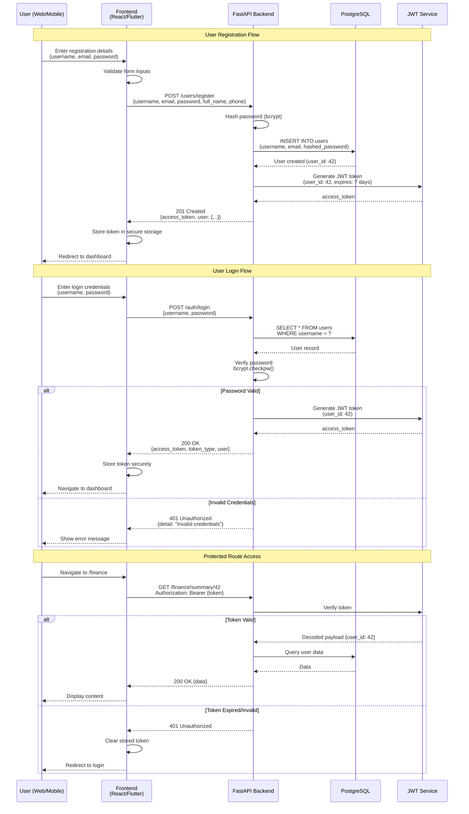

---

## 2. Manual Transaction Entry

### Adding Income/Expense via Dashboard

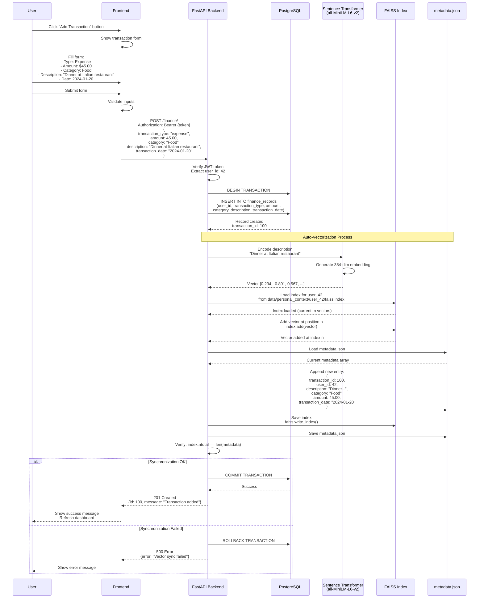

---

## 3. Voice Transaction Entry (Twilio)

### Logging Expense via Phone Call

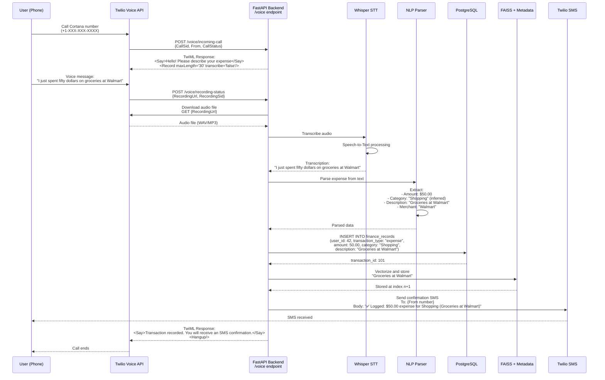

---

## 4. OCR Receipt Scanning

### Scanning Receipt from Mobile App

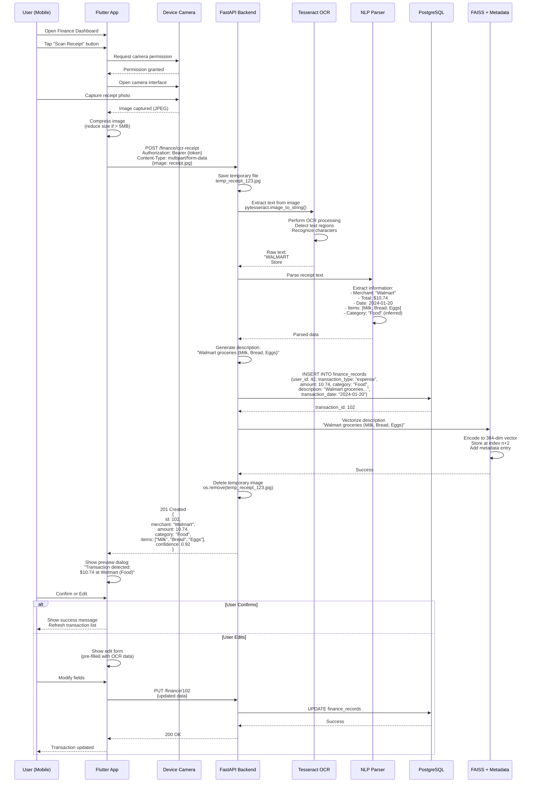

---

## 5. AI Chat with Context Retrieval

### Conversational Finance Query with RAG

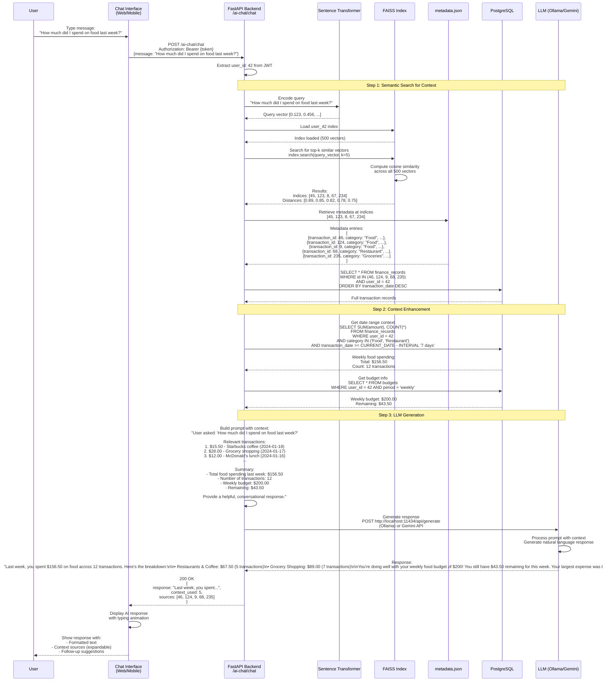

---

## 6. Budget Alert System

### Automatic Budget Threshold Notifications

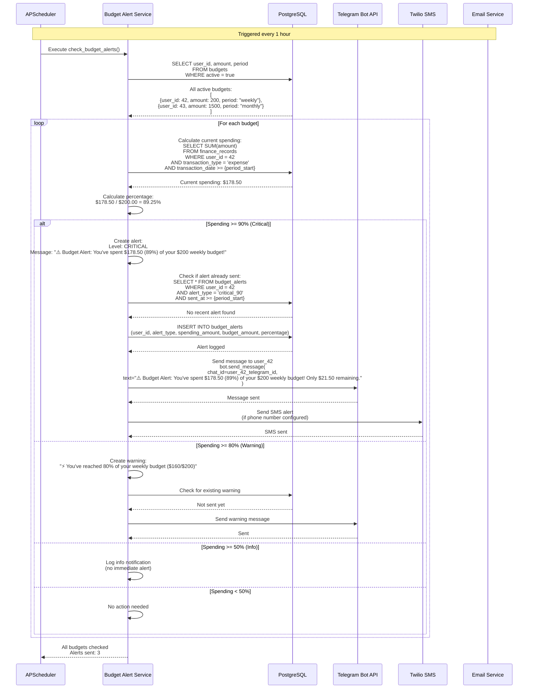

---

## 7. Telegram Bot Integration

### Conversational Expense Logging via Telegram

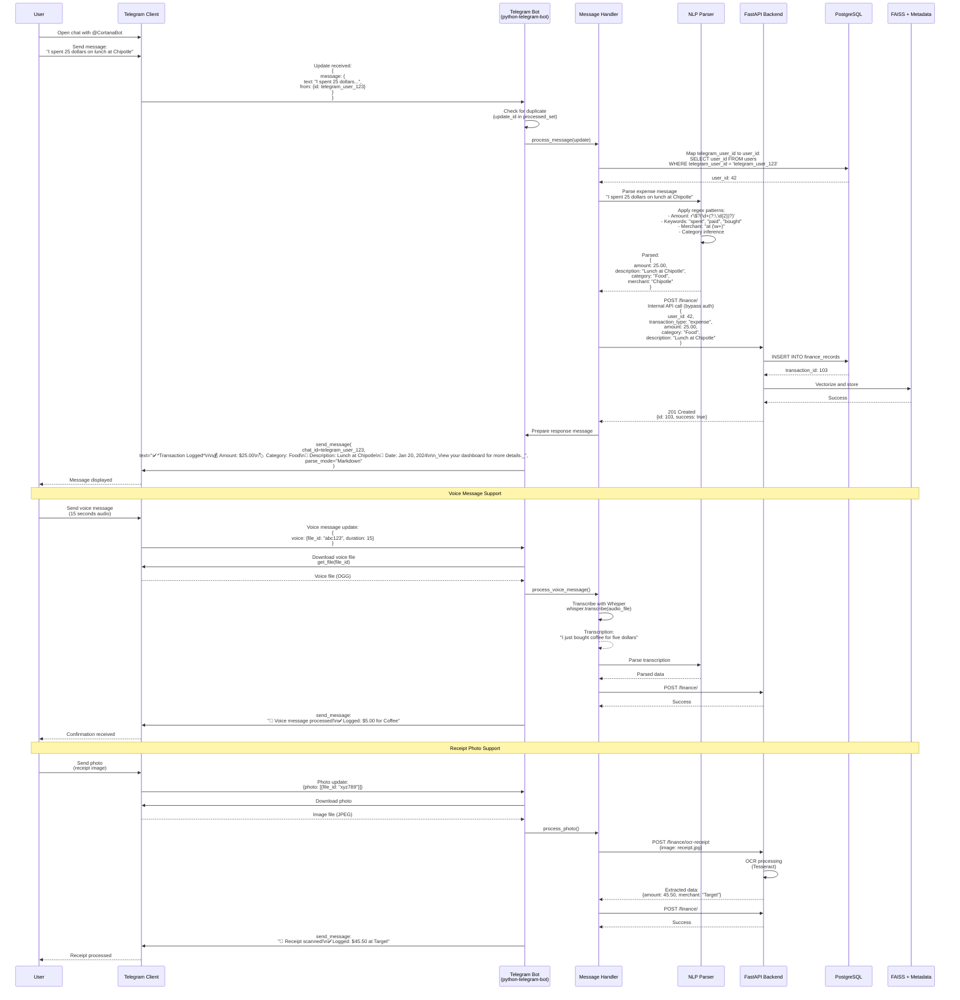

---

## 8. News Aggregation and Delivery

### Daily News Briefing via RSS Feeds

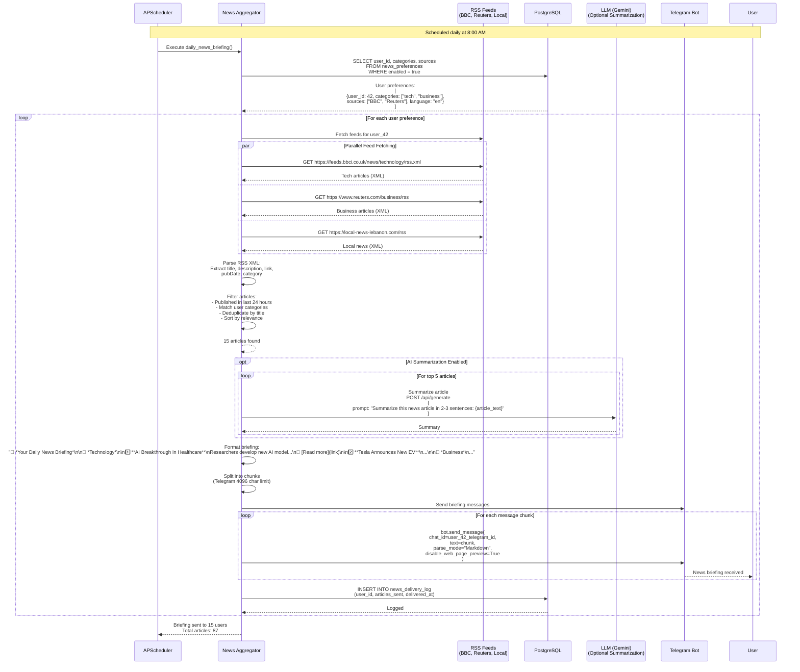

---

## 9. Workout Plan Generation

### AI-Generated Personalized Workout Plans

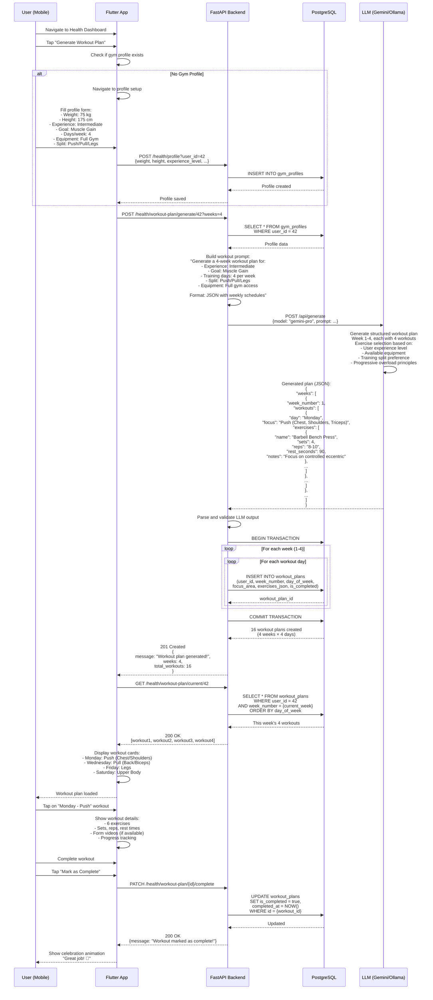

---

## 10. Weekly Financial Summary

### Automated Weekly Report Generation

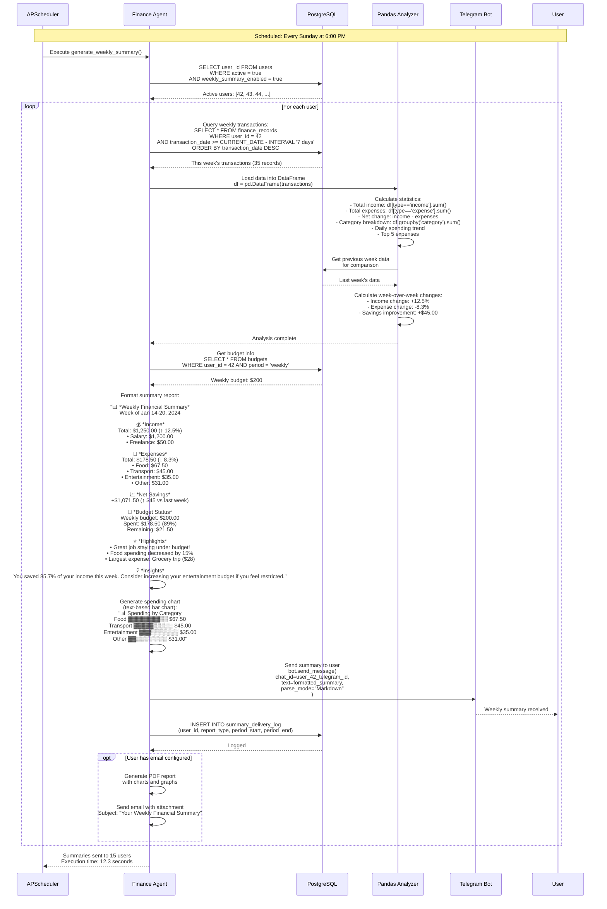

---

## 11. Complete System Architecture

### End-to-End System Flow

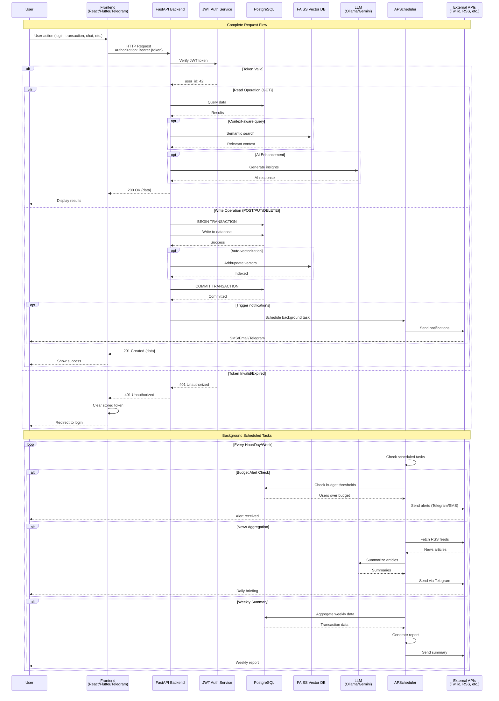

---

## System Component Details

### Technology Stack

| Component | Technology | Purpose |
|-----------|-----------|---------|
| **Frontend** | React.js (Web) | Dashboard, analytics, visualizations |
| **Mobile** | Flutter | iOS/Android native experience |
| **Backend** | FastAPI (Python) | RESTful API, async operations |
| **Database** | PostgreSQL | Relational data storage |
| **Vector DB** | FAISS | Semantic search over transactions |
| **Embedding** | Sentence Transformers | Text to 384-dim vectors |
| **LLM** | Ollama (local) / Gemini (cloud) | AI chat, summarization, insights |
| **Scheduler** | APScheduler | Background tasks, cron jobs |
| **Voice** | Twilio + Whisper | Phone calls, speech-to-text |
| **OCR** | Tesseract | Receipt scanning |
| **Messaging** | Telegram Bot API | Chat interface, notifications |
| **SMS/Voice** | Twilio API | Alerts, voice transactions |
| **News** | RSS Feeds | News aggregation |

### API Endpoints Summary

| Endpoint | Method | Purpose |
|----------|--------|---------|
| `/auth/login` | POST | User authentication |
| `/users/register` | POST | New user signup |
| `/finance/` | POST | Add transaction |
| `/finance/summary/{user_id}` | GET | Get financial summary |
| `/finance/ocr-receipt` | POST | Process receipt image |
| `/ai-chat/chat` | POST | AI conversation |
| `/budget/` | POST | Set/update budget |
| `/budget/category-goal` | POST | Set category goals |
| `/health/profile` | POST | Create gym profile |
| `/health/workout-plan/generate/{user_id}` | POST | Generate workout plan |
| `/voice/incoming-call` | POST | Handle Twilio voice |
| `/telegram/webhook` | POST | Telegram bot updates |

### Data Models

| Model | Key Fields | Relationships |
|-------|-----------|---------------|
| **User** | id, username, email, telegram_user_id | → finance_records, budgets |
| **FinanceRecord** | id, user_id, transaction_type, amount, category, description | user ← |
| **Budget** | id, user_id, amount, period | user ← |
| **CategoryGoal** | id, user_id, category, target_amount | user ← |
| **GymProfile** | id, user_id, weight, height, experience_level | user ← |
| **WorkoutPlan** | id, user_id, week_number, day_of_week, exercises_json | user ← |
| **WorkoutLog** | id, user_id, exercise_name, sets, reps, weight | user ← |

---

## Rendering Instructions

### For Mermaid Live Editor
1. Visit https://mermaid.live
2. Copy each diagram code block
3. Paste and preview
4. Export as PNG/SVG/PDF

### For VS Code
1. Install "Markdown Preview Mermaid Support"
2. Open this file
3. Press Ctrl+Shift+V (Markdown Preview)
4. Right-click diagram → Export

### For Command Line
```bash
npm install -g @mermaid-js/mermaid-cli

mmdc -i diagram.mmd -o output.png -w 1920 -H 1080
```

### For LaTeX
```latex
\begin{figure}[H]
    \centering
    \includegraphics[width=0.95\textwidth]{sequence_diagram.pdf}
    \caption{Complete System Sequence Diagram}
    \label{fig:sequence_complete}
\end{figure}
```

---

## Additional Notes

- All diagrams use consistent color coding
- Participants are clearly labeled with their roles
- Alternative flows (alt/else) show error handling
- Parallel operations (par) show concurrent processing
- Loop constructs show iterative operations
- Notes provide contextual information
- Database transactions show ACID compliance

---

**Document Version**: 1.0
**Last Updated**: January 2026
**Total Diagrams**: 11 comprehensive sequence diagrams
**Coverage**: Complete system workflows from authentication to AI-powered features
