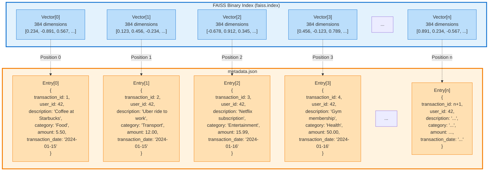
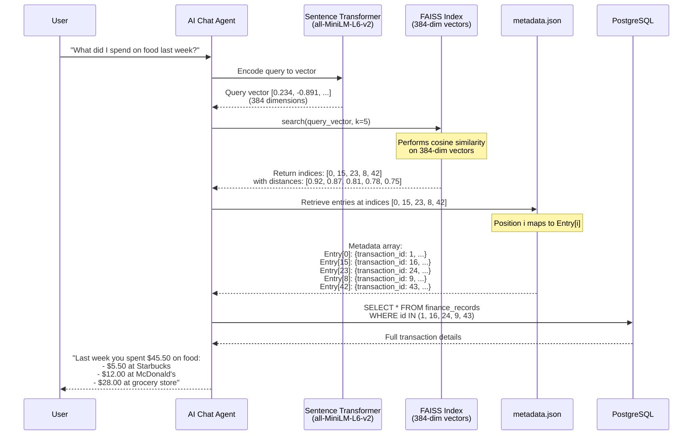
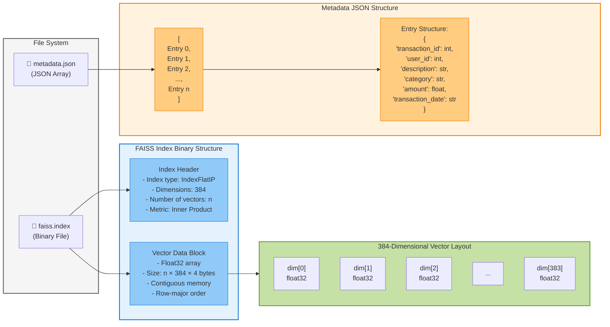
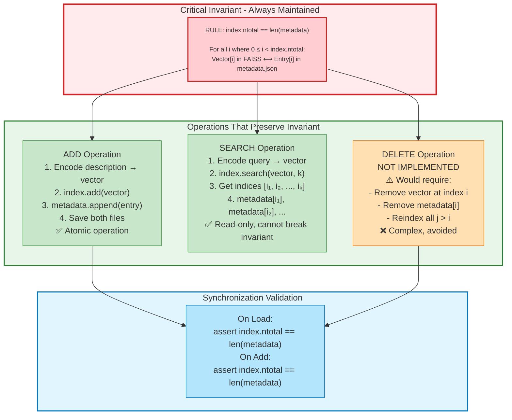

# FAISS Index Structure - Technical Diagram

## Figure 5.2: FAISS Index Structure and Vector-Metadata Correspondence

This diagram illustrates the binary index file structure with 384-dimension vectors and their critical linkage to metadata entries through positional correspondence.

---

## Diagram 1: FAISS Index and Metadata Correspondence



**Key Point**: Vector position **i** in the FAISS index corresponds exactly to metadata entry **i**, establishing the critical linkage between semantic search results and actual database records.

---

## Diagram 2: Semantic Search Flow with Index-Metadata Linkage



---

## Diagram 3: FAISS Binary Index Internal Structure



---

## Diagram 4: Vector Addition and Index Update Process

```mermaid
flowchart TD
    Start([New Transaction Created]) --> Extract[Extract Transaction Data<br/>transaction_id: 100<br/>description: 'Dinner at Italian restaurant'<br/>category: 'Food'<br/>amount: 45.00]

    Extract --> Encode[Encode Description to Vector<br/>Using Sentence Transformer<br/>Input: 'Dinner at Italian restaurant'<br/>Output: 384-dim vector]

    Encode --> CheckIndex{FAISS Index<br/>Exists?}

    CheckIndex -->|No| CreateIndex[Create New Index<br/>faiss.IndexFlatIP(384)]
    CheckIndex -->|Yes| LoadIndex[Load Existing Index<br/>from faiss.index]

    CreateIndex --> AddVector
    LoadIndex --> AddVector[Add Vector to Index<br/>index.add(vector)<br/>New position: n]

    AddVector --> CreateMeta[Create Metadata Entry<br/>{<br/>  transaction_id: 100,<br/>  user_id: 42,<br/>  description: 'Dinner...',<br/>  category: 'Food',<br/>  amount: 45.00,<br/>  transaction_date: '2024-01-20'<br/>}]

    CreateMeta --> AppendMeta[Append to metadata.json<br/>at position n]

    AppendMeta --> SaveIndex[Save FAISS Index<br/>faiss.write_index]

    SaveIndex --> SaveMeta[Save metadata.json<br/>with new entry]

    SaveMeta --> Verify{Verify:<br/>len(vectors) ==<br/>len(metadata)?}

    Verify -->|Yes| Success([✅ Index Updated<br/>Vector[n] ↔ Entry[n]])
    Verify -->|No| Error([❌ Synchronization Error])

    style Start fill:#c8e6c9,stroke:#388e3c,stroke-width:2px
    style Success fill:#c8e6c9,stroke:#388e3c,stroke-width:2px
    style Error fill:#ffcdd2,stroke:#d32f2f,stroke-width:2px
    style Verify fill:#fff9c4,stroke:#f57f17,stroke-width:2px
    style AddVector fill:#bbdefb,stroke:#1976d2,stroke-width:2px
    style AppendMeta fill:#ffe0b2,stroke:#f57c00,stroke-width:2px
```

---

## Diagram 5: Index-Metadata Correspondence Guarantee



---

## Technical Specifications

### FAISS Index Configuration
```python
# Index Initialization
dimension = 384  # Sentence Transformer output dimension
index = faiss.IndexFlatIP(dimension)  # Inner Product (cosine similarity)

# Index Properties
- Type: IndexFlatIP (exact search, no quantization)
- Metric: Inner Product (normalized vectors = cosine similarity)
- Dimension: 384 (all-MiniLM-L6-v2 model)
- Storage: Binary format (.index file)
- Search: Exhaustive (100% recall)
```

### Metadata Structure
```python
# metadata.json format
[
    {
        "transaction_id": 1,          # Primary key from finance_records table
        "user_id": 42,                # User identifier
        "description": "Coffee shop", # Transaction description
        "category": "Food",           # Expense category
        "amount": 5.50,               # Transaction amount
        "transaction_date": "2024-01-15"  # Date string (YYYY-MM-DD)
    },
    # ... more entries
]
```

### Storage Requirements
- **Vector Storage**: n vectors × 384 dimensions × 4 bytes (float32) = n × 1,536 bytes
- **Metadata Storage**: n entries × ~200 bytes average (JSON) = n × 200 bytes
- **Example**: 1,000 transactions = ~1.5 MB (vectors) + ~200 KB (metadata) = ~1.7 MB total

### Performance Characteristics
- **Search Complexity**: O(n × d) where n = number of vectors, d = 384
- **Search Time**: ~1-5ms for 1,000 vectors on typical hardware
- **Memory Usage**: Entire index loaded into RAM for fast access
- **Accuracy**: 100% recall (exact search, no approximation)

---

## Usage Example

### Adding a Transaction to Index
```python
# Step 1: Create transaction in database
transaction = {
    'id': 100,
    'user_id': 42,
    'description': 'Dinner at Italian restaurant',
    'category': 'Food',
    'amount': 45.00,
    'transaction_date': '2024-01-20'
}

# Step 2: Encode description to vector
vector = sentence_transformer.encode(transaction['description'])
# Result: array of 384 float32 values

# Step 3: Add to FAISS index
index.add(vector.reshape(1, -1))
# Vector now at position index.ntotal - 1

# Step 4: Add metadata entry at same position
metadata.append({
    'transaction_id': transaction['id'],
    'user_id': transaction['user_id'],
    'description': transaction['description'],
    'category': transaction['category'],
    'amount': transaction['amount'],
    'transaction_date': transaction['transaction_date']
})

# Step 5: Save both files
faiss.write_index(index, 'faiss.index')
with open('metadata.json', 'w') as f:
    json.dump(metadata, f)
```

### Searching the Index
```python
# Step 1: Encode query
query = "What did I spend on restaurants?"
query_vector = sentence_transformer.encode(query)

# Step 2: Search FAISS index
k = 5  # Top 5 results
distances, indices = index.search(query_vector.reshape(1, -1), k)

# Step 3: Retrieve metadata using indices
results = []
for idx in indices[0]:
    results.append(metadata[idx])  # Direct array access using index

# Step 4: Fetch full details from database
transaction_ids = [m['transaction_id'] for m in results]
full_records = db.query(FinanceRecord).filter(
    FinanceRecord.id.in_(transaction_ids)
).all()
```

---

## Key Insights

1. **Positional Correspondence**: The index position in FAISS is the ONLY link between vectors and metadata. No identifiers are stored in the FAISS index itself.

2. **Synchronization Critical**: Both files (faiss.index and metadata.json) must always have the same number of entries at corresponding positions.

3. **No Deletion**: To maintain synchronization, individual record deletion is not implemented. This avoids reindexing complexity.

4. **Atomic Operations**: All add operations must be atomic - either both vector and metadata are added, or neither.

5. **User Isolation**: Each user has separate index and metadata files (user_1/, user_2/, etc.) for data isolation and privacy.

6. **Embedding Model**: The 384-dimension vectors are produced by the `all-MiniLM-L6-v2` Sentence Transformer model, specifically chosen for:
   - Fast encoding (~50ms per sentence)
   - Good semantic understanding
   - Compact representation (384 vs 768+ dimensions)
   - Optimized for semantic similarity tasks

---

## Rendering Instructions

### For Mermaid Live Editor
1. Visit https://mermaid.live
2. Copy each diagram code block separately
3. Paste into the editor
4. Export as PNG or SVG

### For VS Code (with Mermaid extension)
1. Install "Markdown Preview Mermaid Support" extension
2. Open this file in VS Code
3. Use Markdown preview (Ctrl+Shift+V)
4. Right-click diagram → "Export to PNG/SVG"

### For Command Line (mermaid-cli)
```bash
# Install mermaid-cli
npm install -g @mermaid-js/mermaid-cli

# Convert each diagram
mmdc -i diagram1.mmd -o figure_5_2_correspondence.png
mmdc -i diagram2.mmd -o figure_5_2_search_flow.png
mmdc -i diagram3.mmd -o figure_5_2_binary_structure.png
mmdc -i diagram4.mmd -o figure_5_2_update_process.png
mmdc -i diagram5.mmd -o figure_5_2_invariant.png
```

### For LaTeX/Academic Papers
1. Export diagrams as PDF using Mermaid Live
2. Include in LaTeX with:
```latex
\begin{figure}[htbp]
    \centering
    \includegraphics[width=0.9\textwidth]{figure_5_2_correspondence.pdf}
    \caption{FAISS Index Structure: Vector position \textit{i} in the index corresponds to metadata entry \textit{i}, establishing the critical linkage between semantic search results and actual database records. Each metadata entry contains: transaction\_id, user\_id, description, category, amount, and transaction\_date.}
    \label{fig:faiss_structure}
\end{figure}
```

---

## File Structure in Cortana System

```
cortana/
└── data/
    └── personal_context/
        ├── user_1/
        │   ├── faiss.index        # Binary vector index (user 1)
        │   ├── metadata.json      # Metadata array (user 1)
        │   └── documents.pkl      # Document cache (optional)
        ├── user_2/
        │   ├── faiss.index        # Binary vector index (user 2)
        │   ├── metadata.json      # Metadata array (user 2)
        │   └── documents.pkl
        └── user_n/
            ├── faiss.index
            ├── metadata.json
            └── documents.pkl
```

Each user's directory maintains the critical index-metadata correspondence independently.

---

**Figure 5.2: FAISS Index Structure**
*Technical diagram showing binary index file structure with 384-dimension vectors and metadata.json mappings. The positional correspondence (Vector[i] ↔ Entry[i]) is the fundamental mechanism enabling semantic search over financial transactions.*
